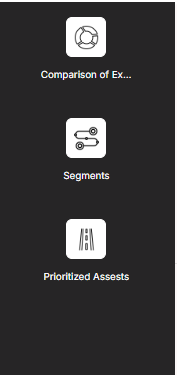
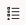
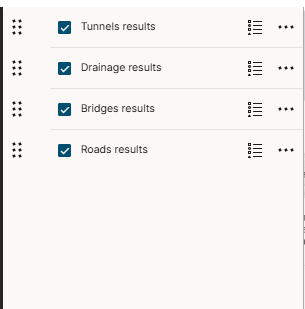
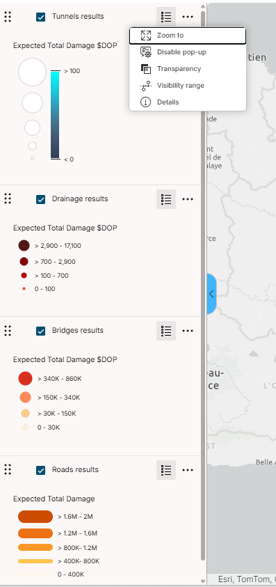
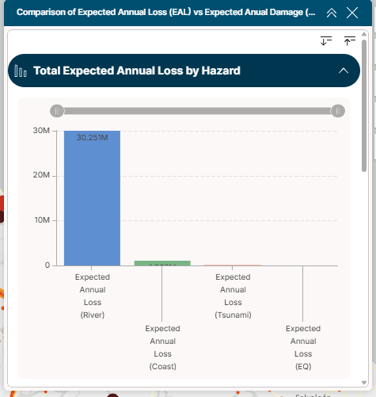
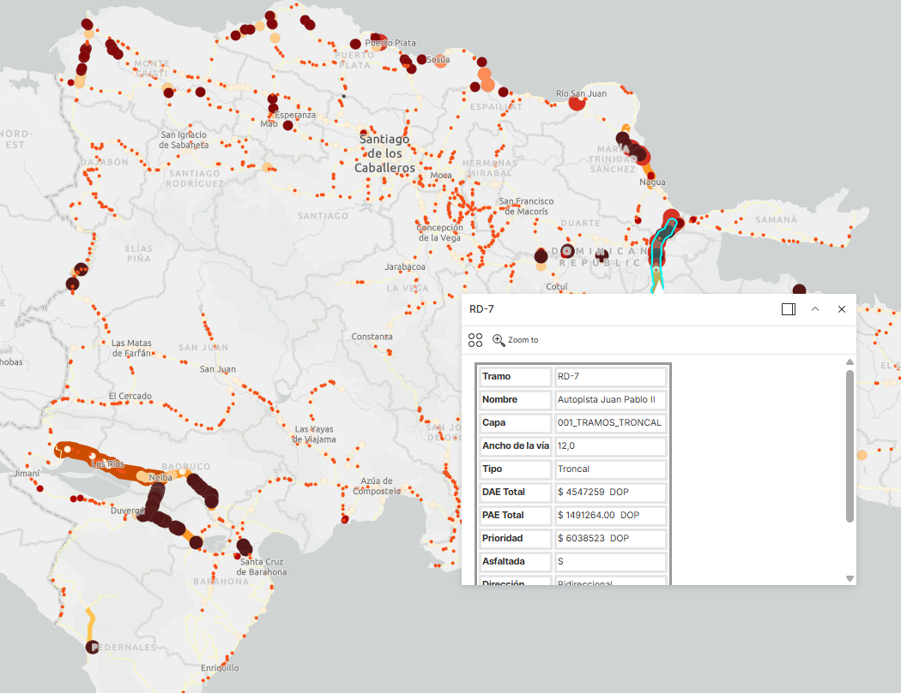
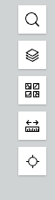
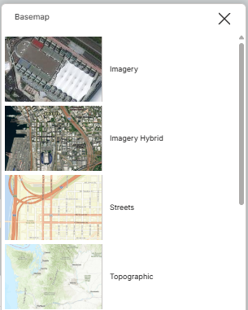
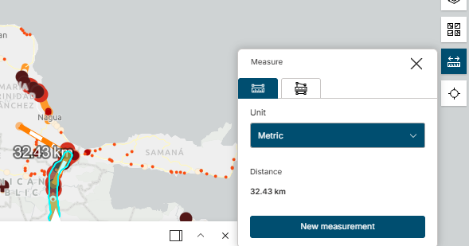

# Exploración del tablero

Las siguientes capturas son las **imágenes originales** de la aplicación de referencia. La interfaz puede cambiar según la versión publicada.

## Navegación entre vistas

El panel permite alternar entre las vistas configuradas para comparar daños y pérdidas, consultar segmentos y revisar activos priorizados. Antes de interpretar cifras, confirme la vista, el escenario y los filtros activos.

## Capas, leyenda y opciones

Active la capa que desea consultar, despliegue su leyenda y verifique indicador, unidad e intervalos. El menú de opciones permite acercar, cambiar transparencia o revisar detalles; estas acciones no modifican los datos.

- 
- 
- 

## Gráficas

Lea siempre título, ejes, unidad, categorías y filtros. Una gráfica agregada no sustituye el valor de un activo específico; para citarlo, conserve su `ID_TRAMO` y consulte la tabla o ventana emergente.

## Selección de activos

Al seleccionar una línea o punto, revise el identificador, nombre, tipo de activo y métricas. Si el clic intercepta varios elementos, recorra todos los registros seleccionados.

## Herramientas cartográficas

Las herramientas de búsqueda, mapas base, medición, geolocalización y transparencia apoyan la navegación. No cambian el cálculo del BSA 2.0 y las mediciones en pantalla no sustituyen los valores de las capas de exposición.

- 
- 
- 

