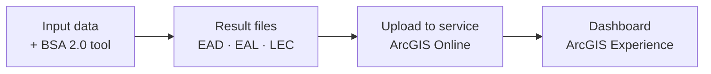

# BSA 2.0 Dashboard

The **BSA 2.0 Dashboard** is the online interface that allows visualizing, exploring, and interpreting the risk analysis results produced by the tool. It is designed to facilitate dialogue with decision-makers and support investment prioritization in transport infrastructure.

<!-- FALTA CAPTURA: vista general del dashboard (pantalla completa con ambas pestañas visibles) -->

!!! info "One dashboard per country"
    Each implemented country has its own dashboard with its specific results. Monetary values are expressed in each country's **local currency** (for example, Dominican pesos — DOP — in the case of the Dominican Republic). See the [Results by country](resultados-paises.md) section to access each dashboard.

---

## What is it and what is it for?

The dashboard is built as an **ArcGIS Experience application** accessible from any web browser, without the need to install additional software. It allows technicians and decision-makers to:

- Identify road assets with the highest accumulated risk (prioritization by EAD and EAL).
- Compare the magnitude of damages and losses between different hazard types.
- Consult loss exceedance curves to understand the probability associated with different levels of impact.
- Explore the interactive map with georeferenced results.

---

## Dashboard structure: two tabs

The dashboard is organized into two main tabs:

### General View

The **General View** tab is the main view of the dashboard. It integrates in a single screen:

- **Summary indicators** at the top: total evaluated length, total EAD, and total EAL of the network.
- **Prioritized assets panel** (left): hierarchical list of assets with the highest risk, segmented by type (roads, drainage, tunnels, bridges).
- **Interactive map** (center): spatial representation of assets with graduated symbology according to risk level.
- **EAL vs. EAD comparison panel** (right): charts that break down results by hazard type and asset type.
- **Critical segments table** (bottom): the five segments with the highest criticality and their EAD and EAL metrics.

### Loss Curves

The **Loss Curves** tab shows the **Loss Exceedance Curves (LEC)** of the analyzed portfolio. These curves allow relating the magnitude of expected losses to their annual frequency of occurrence, a fundamental tool for designing risk management strategies.

---

## Relationship with the BSA 2.0 tool

The dashboard directly consumes the results generated by the BSA 2.0 desktop tool (ArcGIS Pro toolbox). The flow is:

To learn how these results are generated, see the [User Guide](../guia-usuario/resultados.md) section.
