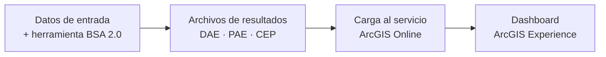

# Dashboard BSA 2.0

El **Dashboard BSA 2.0** es la interfaz en línea que permite visualizar, explorar e interpretar los resultados del análisis de riesgo producidos por la herramienta. Está concebido para facilitar el diálogo con tomadores de decisión y apoyar la priorización de inversiones en infraestructura de transporte.

<!-- FALTA CAPTURA: vista general del dashboard (pantalla completa con ambas pestañas visibles) -->

!!! info "Un dashboard por país"
    Cada país implementado tiene su propio dashboard con sus resultados específicos. Los valores monetarios se expresan en la **moneda local** de cada país (por ejemplo, pesos dominicanos — DOP — en el caso de República Dominicana). Consulte la sección [Resultados por país](resultados-paises.md) para acceder a cada dashboard.

---

## ¿Qué es y para qué sirve?

El dashboard está construido como una **aplicación de ArcGIS Experience** accesible desde cualquier navegador web, sin necesidad de instalar software adicional. Permite a técnicos y tomadores de decisión:

- Identificar los activos viales con mayor riesgo acumulado (priorización por DAE y PAE).
- Comparar la magnitud de daños y pérdidas entre distintos tipos de amenaza.
- Consultar las curvas de excedencia de pérdidas para entender la probabilidad asociada a distintos niveles de impacto.
- Explorar el mapa interactivo con los resultados georreferenciados.

---

## Estructura del dashboard: dos pestañas

El dashboard se organiza en dos pestañas principales:

### General View

La pestaña **General View** es la vista principal del dashboard. Integra en una sola pantalla:

- **Indicadores de resumen** en la parte superior: longitud total evaluada, DAE total y PAE total de la red.
- **Panel de activos priorizados** (izquierda): lista jerarquizada de los activos con mayor riesgo, segmentada por tipo (carreteras, drenaje, túneles, puentes).
- **Mapa interactivo** (centro): representación espacial de los activos con simbología graduada según el nivel de riesgo.
- **Panel de comparación EAL vs. EAD** (derecha): gráficos que desglosan los resultados por tipo de amenaza y por tipo de activo.
- **Tabla de segmentos críticos** (inferior): los cinco segmentos con mayor criticidad y sus métricas de DAE y PAE.

### Loss Curves

La pestaña **Loss Curves** muestra las **curvas de excedencia de pérdidas (CEP)** del portafolio analizado. Estas curvas permiten relacionar la magnitud de las pérdidas esperadas con su frecuencia anual de ocurrencia, herramienta fundamental para el diseño de estrategias de gestión de riesgo.

---

## Relación con la herramienta BSA 2.0

El dashboard consume directamente los resultados generados por la herramienta de escritorio BSA 2.0 (toolbox de ArcGIS Pro). El flujo es:

Para conocer cómo se generan estos resultados, consulte la sección [Guía de Usuario](../guia-usuario/resultados.md).
