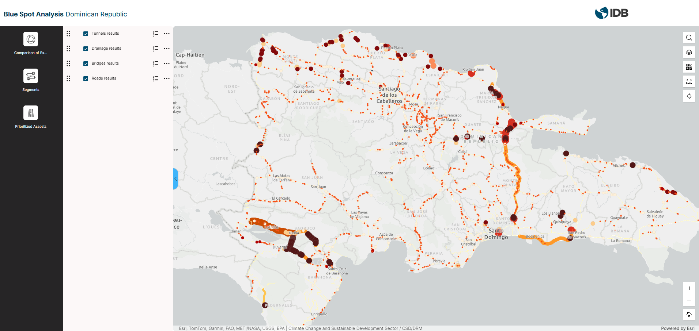

# Dashboard BSA 2.0

El tablero es una aplicación de referencia construida con **ArcGIS Experience Builder** para consultar y comunicar resultados previamente calculados y publicados. No recibe insumos crudos, no ejecuta el toolbox y no recalcula DAE, PAE o prioridad.

[Abrir la implementación de referencia](https://experience.arcgis.com/experience/927adc515c684c7682a8924b403ca8b1){ .md-button .md-button--primary }

## Información que debe publicarse

Como mínimo, las capas deben conservar:

- identificador del activo y, para activos puntuales, `ID_TRAMO`;
- tipo de activo y atributos descriptivos;
- `DAE` o `DAE_total`;
- `PAE_total`;
- `Priority`;
- moneda, año base, escenario, horizonte y versión;
- campos modificados por escenario climático, cuando apliquen.

Las categorías, colores, rangos y filtros deben configurarse sobre campos equivalentes. Una actualización de datos exige revisar pop-ups, gráficos, tablas, joins, filtros y escalas de visualización.

## Lectura responsable

El tablero sirve para explorar concentraciones espaciales y comparar activos dentro de un conjunto homogéneo. No debe usarse para comparar valores con moneda, año base, cobertura o metodología diferentes sin una armonización previa.

