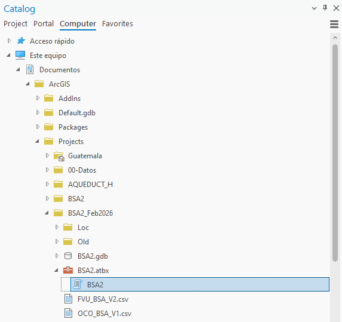
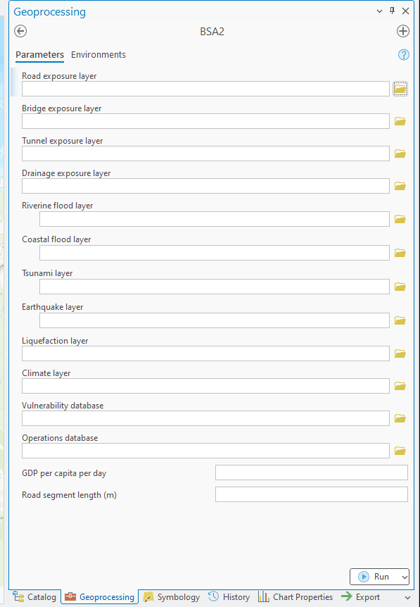

# Interfaz del toolbox

## Abrir la herramienta

En el panel **Catalog** de ArcGIS Pro, localice `BSA2.atbx`, expándalo y abra `BSA2`.

## Campos de entrada

| Etiqueta de la interfaz | Qué se carga | Reglas principales |
|---|---|---|
| **Road exposure layer** | Capa lineal de carreteras | Requerida por el código; un tramo por enlace nodo–nodo. |
| **Bridge exposure layer** | Capa puntual de puentes | Opcional; debe incluir `ID_TRAMO`. |
| **Tunnel exposure layer** | Capa puntual de túneles | Opcional; debe incluir `ID_TRAMO`. |
| **Drainage exposure layer** | Capa puntual de drenajes | Opcional; debe incluir `ID_TRAMO`. |
| **Riverine flood layer** | Uno o varios rásteres | Multivalor; tirante en metros, por TR. |
| **Coastal flood layer** | Uno o varios rásteres | Multivalor; tirante en metros, por TR. |
| **Tsunami layer** | Uno o varios rásteres | Multivalor; tirante en metros, por TR. |
| **Earthquake layer** | Uno o varios rásteres | Multivalor; PGA o SA en g, por TR. |
| **Liquefaction layer** | Un ráster | Opcional; clases 1–4, complemento de sismo. |
| **Climate layer** | Capa poligonal | Opcional; cambio de frecuencia mediante campos `TP#S#M`. |
| **Vulnerability database** | Archivo CSV | Requerido; funciones RMD y T. |
| **Operations database** | Archivo CSV | `taxonomy`, `COV` y `OCU`; se usa junto con PIB. |
| **GDP per capita per day** | Número decimal | Valor monetario por persona y día, en moneda local. |
| **Road segment length (m)** | Número decimal positivo | Separación en metros para crear puntos de muestreo sobre las vías. |

## PIB per cápita diario

Ingrese directamente el valor en la moneda local del país. Documente la fuente y el año base. Si parte de un PIB per cápita anual, use una conversión consistente —por ejemplo, dividir entre 365— y no mezcle monedas entre costos de reposición, operación y PIB.

La base de operaciones y el PIB deben cargarse juntos. Si sólo se carga uno, el toolbox detiene la ejecución.

## Longitud de segmento

Este valor controla la densidad del muestreo de intensidad:

- una distancia corta genera más puntos, mayor detalle y mayor tiempo de cómputo;
- una distancia larga genera menos puntos, menor detalle y una corrida más rápida.

Defínala en función de la resolución espacial de las mallas de amenaza y haga una prueba de sensibilidad. No es la longitud con la que se reconstruye la topología vial.

## Salidas

El toolbox crea cuatro capas derivadas cuando corresponda: **Road damage layers**, **Bridge damage layers**, **Tunnel damage layers** y **Drainage damage layer**. Las salidas efectivas se almacenan en `BSA2.gdb`.

