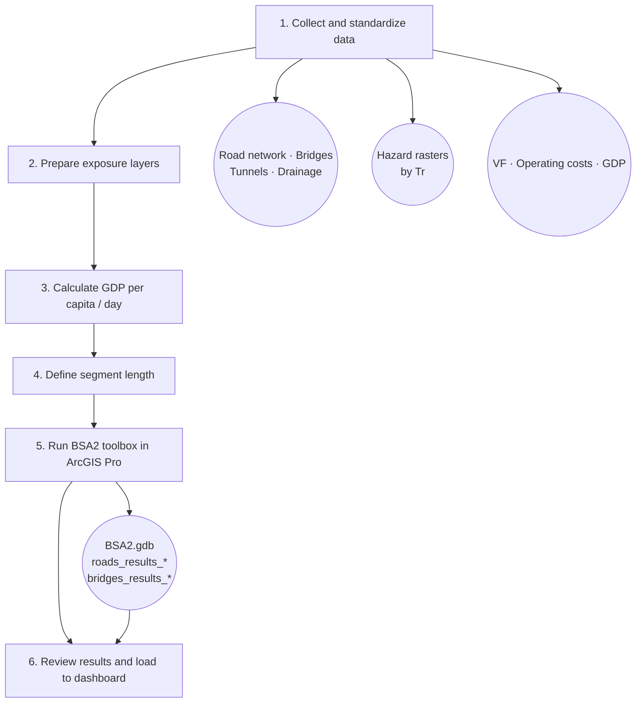

# Workflow

The BSA 2.0 analysis follows a logical sequence of six stages, from data collection to results visualization in the IDB dashboard.

## General diagram

## Stage 1 — Collect and standardize data

Gather all necessary inputs and verify they meet the required format:

- **Road asset inventory:** road network, bridges, tunnels, and drainage in shapefile format, with the minimum attributes indicated in [Input data](datos-entrada.md).
- **Hazard grids:** GeoTIFF rasters for fluvial flooding, pluvial/coastal flooding, earthquake, tsunami, and/or liquefaction, one per return period (Tr), named according to the convention `{hazard}_{horizon}_{country}_{Tr}.tif`.
- **Databases:** CSV file with vulnerability functions (`FVU_BSA_Vx.csv`) and CSV file with operating costs (`OCO_BSA_{country}.csv`).

!!! warning "Spatial reference system"
    All vector layers and hazard rasters must be in the **same coordinate reference system (CRS)**. Use ArcGIS Pro to reproject any layers that are not aligned before running the toolbox.

## Stage 2 — Prepare exposure layers

For the road network, complete and validate the key attributes for each segment:

- `ID_TRAMO`: unique identifier per segment. All components (bridges, tunnels, drainage) associated with the segment must have the same value.
- `vul_f` and `vul_eq`: vulnerability taxonomy codes. Must exactly match the keys in the VF file (no extra spaces).
- `rep_cost_k`: replacement cost in thousands of USD per meter (for roads) or total USD (for bridges and drainage, field `rep_cost`).
- `T9`–`T15`: Annual Average Daily Traffic by vehicle type. If detailed traffic counts are not available, estimates can be used from total AADT data and the country's vehicle type distribution.

## Stage 3 — Calculate GDP per capita per day

The **GDP per capita per day** parameter (`gdppca_doub`) is used to economically value the time lost by road users during an interruption. It is calculated as:

$$
\text{GDP per capita/day} = \frac{\text{Annual GDP per capita (USD)}}{365}
$$

Use the most up-to-date data available for the region or department of analysis. If only national data exists, repeat that value for the entire territory.

**Example (Costa Rica, 2024):** Annual GDP per capita ≈ USD 16,500 → GDP/day ≈ USD 45.2

## Stage 4 — Define segment length

The segment length (`road_segme`) determines every how many meters the tool places a sampling point on the road network. It defines the balance between spatial resolution and computation time:

| Context | Suggested value |
|---------|----------------|
| Exploratory analysis or extensive networks (> 10,000 km) | 50–100 m |
| Standard national-scale analysis | 50 m |
| High-precision corridor analysis | 10–30 m |

For the Costa Rica case, **30 meters** were used.

## Stage 5 — Run the BSA2 toolbox

1. Open ArcGIS Pro with the configured project.
2. In the **Catalog** panel, locate the **BSA2** toolbox and double-click on the tool.
3. Assign each parameter as described in [Tool interface](../getting-started/interfaz.md) and the [Configuring a run](configuracion-corrida.md) guide.
4. Click **Run**.

The tool may take from minutes (short corridors) to several hours (national networks). Upon completion, results are automatically added to the active map.

!!! tip "Traceability .loc file"
    At the end of each run, the toolbox saves a `run_config_<timestamp>.loc` file in the `Loc/` folder with all the parameters used. Keep these files to reproduce or audit the analysis.

## Stage 6 — Review results and load to dashboard

Once the run is complete:

1. Explore the result layers (`roads_results_*`, `bridges_results_*`, etc.) in ArcGIS Pro. Symbolize segments using the `Priority` field (= total EAD + total EAL) to visualize the prioritization map.
2. Verify that EAD, EAL, and Priority values are consistent with the country's context (magnitudes, spatial distribution).
3. For multi-country analysis, results can be loaded to the IDB dashboard, where risk indicators, exceedance curves, and interactive prioritization rankings are visualized.

See [Results](resultados.md) for the full description of output fields and how to interpret them.
