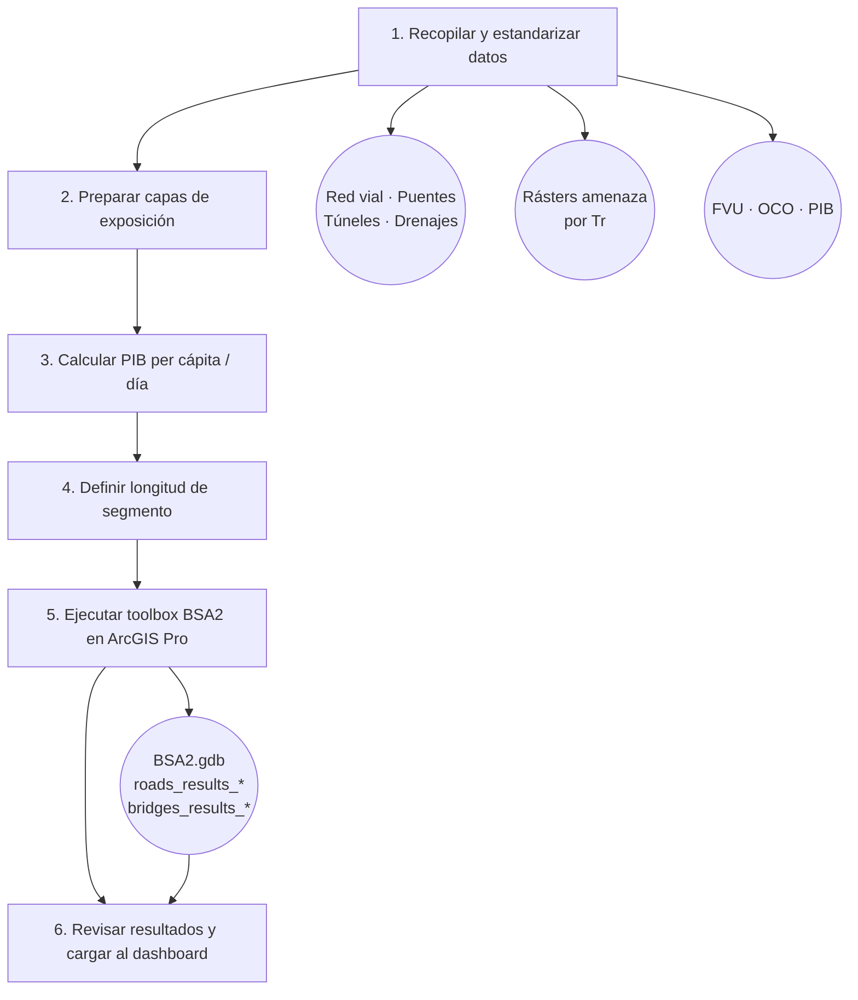

# Flujo de trabajo

El análisis con el BSA 2.0 sigue una secuencia lógica de seis etapas, desde la recopilación de datos hasta la visualización de resultados en el dashboard del BID.

## Diagrama general

## Etapa 1 — Recopilar y estandarizar datos

Reúna todos los insumos necesarios y verifique que cumplen el formato requerido:

- **Inventario de activos viales:** red de carreteras, puentes, túneles y drenajes en formato shapefile, con los atributos mínimos indicados en [Datos de entrada](datos-entrada.md).
- **Mallas de amenaza:** rásters GeoTIFF de inundación fluvial, pluvial/costera, sismo, tsunami y/o licuefacción, uno por período de retorno (Tr), nombrados según la convención `{amenaza}_{horizonte}_{país}_{Tr}.tif`.
- **Bases de datos:** archivo CSV de funciones de vulnerabilidad (`FVU_BSA_Vx.csv`) y archivo CSV de costos operativos (`OCO_BSA_{país}.csv`).

!!! warning "Sistema de referencia espacial"
    Todas las capas vectoriales y los rásters de amenaza deben estar en el **mismo sistema de referencia de coordenadas (SRC)**. Use ArcGIS Pro para reprojectar las capas que no estén alineadas antes de ejecutar el toolbox.

## Etapa 2 — Preparar capas de exposición

Para la red vial, complete y valide los atributos clave en cada tramo:

- `ID_TRAMO`: identificador único por tramo. Todos los componentes (puentes, túneles, drenajes) asociados al tramo deben tener el mismo valor.
- `vul_f` y `vul_eq`: códigos de taxonomía de vulnerabilidad. Deben corresponder exactamente a las claves del archivo FVU (sin espacios adicionales).
- `rep_cost_k`: costo de reposición en miles de USD por metro (para vías) o USD totales (para puentes y drenajes, campo `rep_cost`).
- `T9`–`T15`: Tránsito Promedio Diario Anual por tipo de vehículo. Si no se dispone de aforo detallado, puede usar estimaciones a partir de datos de TPDA total y la distribución por tipo de vehículo del país.

## Etapa 3 — Calcular el PIB per cápita por día

El parámetro **PIB per cápita por día** (`gdppca_doub`) se usa para valorar económicamente el tiempo perdido por los usuarios de la vía durante una interrupción. Se calcula así:

$$
\text{PIB per cápita/día} = \frac{\text{PIB per cápita anual (USD)}}{365}
$$

Utilice el dato más actualizado disponible para la región o departamento de análisis. Si solo existe el dato nacional, repita ese valor para todo el territorio.

**Ejemplo (Costa Rica, 2024):** PIB per cápita anual ≈ USD 16,500 → PIB/día ≈ USD 45.2

## Etapa 4 — Definir la longitud de segmento

La longitud de segmento (`road_segme`) determina cada cuántos metros la herramienta coloca un punto de muestreo sobre la red vial. Define el equilibrio entre resolución espacial y tiempo de cómputo:

| Contexto | Valor sugerido |
|----------|---------------|
| Análisis exploratorio o redes extensas (> 10 000 km) | 50–100 m |
| Análisis estándar a escala nacional | 50 m |
| Análisis de corredor de alta precisión | 10–30 m |

Para el caso de Costa Rica se usaron **30 metros**.

## Etapa 5 — Ejecutar el toolbox BSA2

1. Abra ArcGIS Pro con el proyecto configurado.
2. En el panel **Catalog**, localice el toolbox **BSA2** y haga doble clic en la herramienta.
3. Asigne cada parámetro según la descripción en [Interfaz de la herramienta](../getting-started/interfaz.md) y la guía de [Configuración de una corrida](configuracion-corrida.md).
4. Haga clic en **Run**.

La herramienta puede tardar desde minutos (corredores cortos) hasta varias horas (redes nacionales). Al finalizar, los resultados se agregan automáticamente al mapa activo.

!!! tip "Archivo .loc de trazabilidad"
    Al terminar cada corrida, el toolbox guarda un archivo `run_config_<timestamp>.loc` en la carpeta `Loc/` con todos los parámetros usados. Conserve estos archivos para reproducir o auditar el análisis.

## Etapa 6 — Revisar resultados y cargar al dashboard

Una vez finalizada la ejecución:

1. Explore las capas de resultados (`roads_results_*`, `bridges_results_*`, etc.) en ArcGIS Pro. Simbolice los tramos por el campo `Priority` (= DAE total + PAE total) para visualizar el mapa de priorización.
2. Verifique que los valores de DAE, PAE y Priority son coherentes con el contexto del país (magnitudes, distribución espacial).
3. Para el análisis multipaís, los resultados pueden cargarse al dashboard del BID, donde se visualizan indicadores de riesgo, curvas de excedencia y rankings de priorización interactivos.

Consulte [Resultados](resultados.md) para la descripción completa de los campos de salida y cómo interpretarlos.
