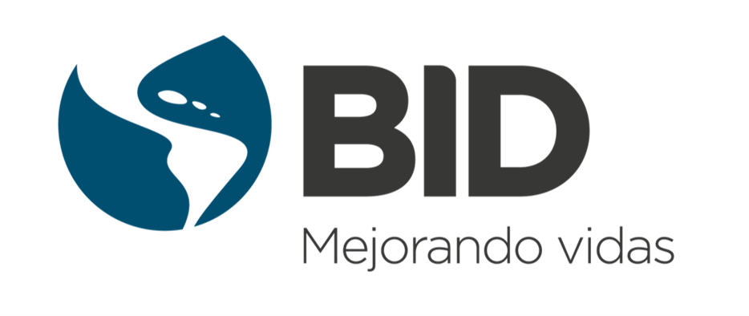

# Blue Spot Analysis 2.0

  

The **Blue Spot Analysis 2.0 (BSA 2.0)** is a methodology and tool developed by the Inter-American Development Bank (IDB) to **prioritize investments in transport infrastructure** against natural hazards. It combines hazard, exposure, vulnerability, and criticality analysis of road networks to estimate risk and generate priority asset rankings at national or regional scale.

---

## How to navigate this documentation

-   :material-map-clock:{ .lg .middle } **Methodology**

    ---

    Full conceptual framework: hazard, exposure, vulnerability, criticality, and risk calculation.

    [:octicons-arrow-right-24: View methodology](metodologia/index.md)

-   :material-rocket-launch:{ .lg .middle } **Getting Started**

    ---

    Requirements, tool installation, and input data organization.

    [:octicons-arrow-right-24: Get started](getting-started/index.md)

-   :material-book-open-variant:{ .lg .middle } **User Guide**

    ---

    Step-by-step workflow, run configuration, and results interpretation.

    [:octicons-arrow-right-24: View guide](guia-usuario/index.md)

-   :material-monitor-dashboard:{ .lg .middle } **Dashboard**

    ---

    Online interface to visualize results and engage with decision-makers.

    [:octicons-arrow-right-24: Explore dashboard](dashboard/index.md)

-   :material-download:{ .lg .middle } **Resources**

    ---

    Bibliographic references, frequently asked questions, and downloadable materials.

    [:octicons-arrow-right-24: View resources](recursos/index.md)

-   :material-alphabetical:{ .lg .middle } **Glossary**

    ---

    Definitions of technical concepts and acronym dictionary.

    [:octicons-arrow-right-24: View glossary](glosario/index.md)

---

## What questions does BSA 2.0 answer?

- Which road segments concentrate the highest risk from flooding, earthquakes, or other hazards?
- What is the Expected Annual Damage (EAD) and Expected Annual Loss (EAL) of the evaluated network?
- Which investments would reduce risk the most with available resources?
- How does risk compare across different asset types (roads, bridges, tunnels, drainage)?

---

## Who is this documentation for?

| Profile | What you will find here |
|---------|------------------------|
| **Technical user** — risk specialists, GIS units, consultants | Detailed methodology, data structure, tool user guide |
| **Strategic user** — ministries, project managers, decision-makers | Key concepts, results interpretation, dashboard use |

---

## Project team

### Leadership and strategic governance

| Role | Person |
|------|--------|
| Executive Sponsor TSP — Program Leader | **Manuel Rodríguez** |
| Executive Sponsor DRM — Program Leader | **Ginés Suárez** |
| TSP Operational Advisor | **Gonzalo Rodríguez Valverde** |
| Senior Scientific-Economic Advisor | **Adrien Vogt-Schilb** |

### BSA 2.0 Product Direction

| Role | Person |
|------|--------|
| General Coordination (DRM) — Operational Direction | **María Alejandra Escovar** |
| Functional Technical Lead — Hydrometeorological SME | **Juan Camilo Olaya** |
| Technical Coordinator — Architecture and Backend | **Kenneth Otárola** |

### Execution teams

??? note "Block A — Technical development and modeling"

    | Person | Role |
    |--------|------|
    | **Andrés Abarca** | Multi-hazard SME and technical QA support |
    | **María Carolina Rogelis** | Technical QA Lead and expert hydrometeorological reviewer |
    | **Walter Cortés** | Full-stack GIS Lead and user experience |
    | **Roque Rodas** | Technical Lead for road infrastructure exposure modeling |
    | **Joel Deplaen** | Methodological Lead for criticality, social vulnerability, and network modeling |

??? note "Block B — Research, data, and specialized modules"

    | Person | Role |
    |--------|------|
    | **Mariam Peña** | Applied research specialist, GIS, and value chain module |
    | **Consulting firm (TBD)** | Lead for the road infrastructure vulnerability component |

??? note "Block C — Adoption, coordination, and country application"

    | Person | Country / Role |
    |--------|---------------|
    | **Benoit Lefevre** | Dominican Republic — focal point and operational sponsor |
    | **Fernando Quirós** | Costa Rica — sectoral specialist in road exposure |
    | **José Rodrigo Rendón** | El Salvador — focal point and operational sponsor |
    | **Pablo Guerrero** | Trinidad and Tobago — focal point and operational sponsor |
    | **Rodrigo Donoso** | Haiti — focal point and operational sponsor |
    | **Leydis** | Panama — focal point |

??? note "Block D — Communication, outreach, and design"

    | Person | Role |
    |--------|------|
    | **Mónica Gamboa** | Strategic communication and outreach lead |
    | **Valmore Castillo** | UX/UI designer and visual communication |

---

## Contact

**Project contact:**
María Alejandra Escovar — [MARIAESC@IADB.ORG](mailto:MARIAESC@IADB.ORG)

**IDB divisions involved:**
TSP (Transport) · DRM (Disaster Risk Management) · CCS (Climate Change)

---

## License

This project is distributed under the **IDB License AM-331-A3 of the Inter-American Development Bank**.
See the full text on the [License](licencia.md) page.
