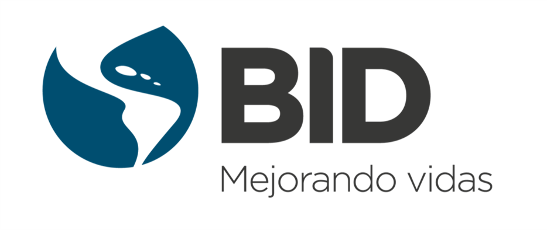

# Blue Spot Analysis 2.0

  

El **Blue Spot Analysis 2.0 (BSA 2.0)** es una metodología y herramienta desarrollada por el Banco Interamericano de Desarrollo (BID) para **priorizar inversiones en infraestructura de transporte** ante amenazas naturales. Combina análisis de amenaza, exposición, vulnerabilidad y criticidad de la red vial para estimar el riesgo y generar rankings de activos prioritarios a escala nacional o regional.

---

## ¿Qué preguntas responde el BSA 2.0?

- ¿Qué tramos viales concentran el mayor riesgo por inundación, sismo u otras amenazas?
- ¿Cuál es el Daño Anual Esperado (DAE) y la Pérdida Anual Esperada (PAE) de la red evaluada?
- ¿Qué inversiones reducirían más el riesgo con los recursos disponibles?
- ¿Cómo se compara el riesgo entre distintos tipos de activos (carreteras, puentes, túneles, drenaje)?

---

## ¿A quién va dirigida esta documentación?

| Perfil | Qué encontrará aquí |
|--------|---------------------|
| **Usuario técnico** — especialistas en riesgo, unidades SIG, consultores | Metodología detallada, estructura de datos, guía de uso de la herramienta |
| **Usuario estratégico** — ministerios, gerentes de proyecto, tomadores de decisión | Conceptos clave, interpretación de resultados, uso del dashboard |

---

## Cómo navegar la documentación

-   :material-map-clock:{ .lg .middle } **Metodología**

    ---

    Marco conceptual completo: amenaza, exposición, vulnerabilidad, criticidad y cálculo de riesgo.

    [:octicons-arrow-right-24: Ver metodología](metodologia/index.md)

-   :material-rocket-launch:{ .lg .middle } **Primeros pasos**

    ---

    Requisitos, instalación de la herramienta y organización de los datos de entrada.

    [:octicons-arrow-right-24: Comenzar](getting-started/index.md)

-   :material-book-open-variant:{ .lg .middle } **Guía de Usuario**

    ---

    Flujo de trabajo paso a paso, configuración de una corrida y lectura de resultados.

    [:octicons-arrow-right-24: Ver guía](guia-usuario/index.md)

-   :material-monitor-dashboard:{ .lg .middle } **Dashboard**

    ---

    Interfaz en línea para visualizar resultados e interactuar con tomadores de decisión.

    [:octicons-arrow-right-24: Explorar dashboard](dashboard/index.md)

-   :material-download:{ .lg .middle } **Recursos**

    ---

    Referencias bibliográficas, preguntas frecuentes y materiales descargables.

    [:octicons-arrow-right-24: Ver recursos](recursos/index.md)

-   :material-alphabetical:{ .lg .middle } **Glosario**

    ---

    Definiciones de conceptos técnicos y diccionario de siglas.

    [:octicons-arrow-right-24: Ver glosario](glosario/index.md)

---

## Equipo del proyecto

### Liderazgo y gobernanza estratégica

| Rol | Persona |
|-----|---------|
| Patrocinador Ejecutivo TSP — Líder del programa | **Manuel Rodríguez** |
| Patrocinador Ejecutivo DRM — Líder del programa | **Ginés Suárez** |
| Asesor operacional TSP | **Gonzalo Rodríguez Valverde** |
| Asesor científico-económico senior | **Adrien Vogt-Schilb** |

### Dirección del producto BSA 2.0

| Rol | Persona |
|-----|---------|
| Coordinación general (DRM) — Dirección operativa | **María Alejandra Escovar** |
| Líder técnico funcional — SME hidrometeorológico | **Juan Camilo Olaya** |
| Coordinador técnico — Arquitectura y backend | **Kenneth Otárola** |

### Equipos de ejecución

??? note "Bloque A — Desarrollo técnico y modelación"

    | Persona | Rol |
    |---------|-----|
    | **Andrés Abarca** | SME multiamenaza y apoyo técnico en Q/A |
    | **María Carolina Rogelis** | Líder de QA técnico y revisión experta hidrometeorológica |
    | **Walter Cortés** | Líder GIS full-stack y experiencia de usuario |
    | **Roque Rodas** | Líder técnico de modelación de exposición de infraestructura vial |
    | **Joel Deplaen** | Líder metodológico en criticidad, vulnerabilidad social y modelación de redes |

??? note "Bloque B — Investigación, datos y módulos especializados"

    | Persona | Rol |
    |---------|-----|
    | **Mariam Peña** | Especialista en investigación aplicada, SIG y módulo de cadenas de valor |
    | **Empresa consultora (por definir)** | Líder del componente de vulnerabilidad de infraestructura vial |

??? note "Bloque C — Adopción, articulación y aplicación en países"

    | Persona | País / Rol |
    |---------|-----------|
    | **Benoit Lefevre** | República Dominicana — punto focal y sponsor operativo |
    | **Fernando Quirós** | Costa Rica — especialista sectorial en exposición vial |
    | **José Rodrigo Rendón** | El Salvador — punto focal y sponsor operativo |
    | **Pablo Guerrero** | Trinidad y Tobago — punto focal y sponsor operativo |
    | **Rodrigo Donoso** | Haití — punto focal y sponsor operativo |
    | **Leydis** | Panamá — punto focal |

??? note "Bloque D — Comunicación, difusión y diseño"

    | Persona | Rol |
    |---------|-----|
    | **Mónica Gamboa** | Líder de comunicación estratégica y difusión |
    | **Valmore Castillo** | Diseñador UX/UI y comunicación visual |

---

## Contacto

**Punto de contacto del proyecto:**
María Alejandra Escovar — [MARIAESC@IADB.ORG](mailto:MARIAESC@IADB.ORG)

**Divisiones del BID involucradas:**
TSP (Transporte) · DRM (Gestión de Riesgo de Desastres) · CCS (Cambio Climático)

---

## Licencia

Este proyecto se distribuye bajo la **licencia AM-331-A3 del Banco Interamericano de Desarrollo**.
Consulte el texto completo en la página [Licencia](licencia.md).
