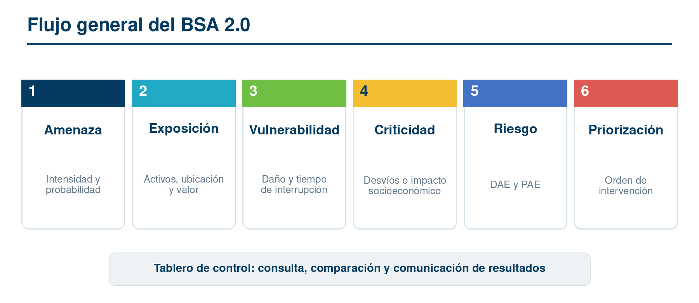

# Blue Spot Analysis 2.0

El **Blue Spot Analysis 2.0 (BSA 2.0)** es una herramienta de cribado para estimar y comparar las consecuencias económicas esperadas del daño físico y de la interrupción funcional de una red vial. Integra información preparada por el usuario y produce resultados comparables por tramo para apoyar estudios, mantenimiento e inversiones de resiliencia.

!!! important "Qué hace —y qué no hace— el BSA 2.0"
    El BSA 2.0 **no genera** modelos de amenaza, inventarios de exposición ni funciones de vulnerabilidad; tampoco produce datos de tránsito, costos o parámetros macroeconómicos. El usuario debe preparar, documentar y validar estos insumos conforme a los formatos, nombres, unidades, taxonomías y sistema de referencia indicados en esta documentación. La herramienta los integra y ejecuta el flujo de cálculo, pero no certifica su calidad científica.

## Enfoque metodológico

El BSA 2.0 emplea una **evaluación probabilística simplificada del riesgo de desastres**. Para cada período de retorno combina intensidad, exposición y vulnerabilidad; estima daños físicos y pérdidas por interrupción; e integra las consecuencias discretas para calcular:

- **DAE:** daño anual esperado por afectación física y reposición.
- **PAE:** pérdida anual esperada asociada a la interrupción del tránsito.
- **Prioridad:** suma directa `DAE_total + PAE_total`, expresada en la misma moneda por año.

El enfoque es coherente con los principios de la metodología del BID para evaluación del riesgo de desastres y cambio climático, pero no constituye un catálogo estocástico completo ni propaga todas las fuentes de incertidumbre.

## Implementación

La herramienta está desarrollada en **Python con ArcPy** y se distribuye como un toolbox para **ArcGIS Pro** (`BSA2.atbx`). Opera sobre capas ráster y vectoriales, archivos CSV y parámetros numéricos. Los resultados se guardan como clases de entidad en una geodatabase y pueden publicarse posteriormente en el tablero de control.

## Recorrido recomendado

1. Consulte la [metodología](metodologia/index.md) y sus supuestos.
2. Verifique los [requisitos del sistema](getting-started/requisitos.md).
3. Prepare los insumos según la [estructura de datos](metodologia/estructura-datos.md).
4. Revise cada campo de la [interfaz del toolbox](getting-started/interfaz.md).
5. Ejecute el [flujo de trabajo](guia-usuario/flujo-trabajo.md) y valide los [resultados](guia-usuario/resultados.md).
6. Publique y explore los resultados en el [dashboard](dashboard/index.md).

!!! warning "Uso de los resultados"
    El BSA 2.0 orienta la comparación y el cribado de activos. No sustituye estudios de ingeniería de detalle, inspecciones de campo, análisis costo-beneficio ni evaluaciones sociales y ambientales.

