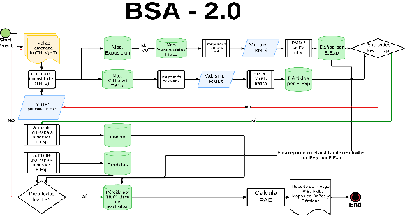
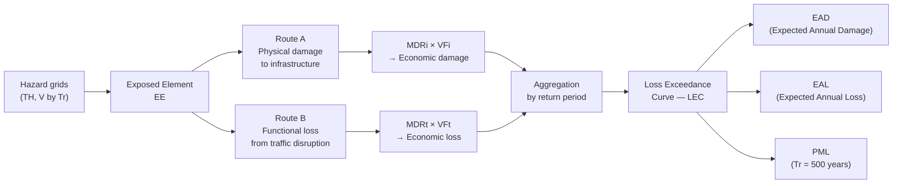
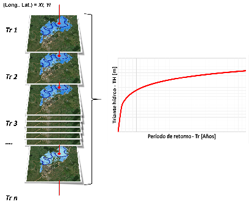
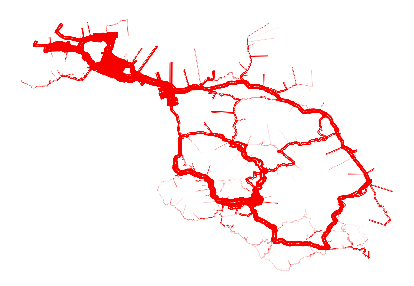

# Functional Logic and Architecture

## Modular and integrated system

The BSA 2.0 tool is conceived as a modular and flexible system that integrates multiple geospatial, climatic, and functional information sources to identify and analyze road segments exposed to natural hazards. Its architecture combines independent analytical components with an automated workflow that generates replicable and comparable outputs across countries and regions.

The functional logic is organized into **five main modules**:

1. **Hazard**: spatial and temporal characterization of natural hazards.
2. **Exposure**: identification and valuation of exposed infrastructure.
3. **Criticality**: analysis of the functional importance of each network segment.
4. **Vulnerability**: estimation of expected damage by typology and intensity.
5. **Risk**: integration of the previous modules to calculate EAD, EAL, PML, and LEC.

A **cross-cutting module of archetypes** of structural and non-structural measures for risk reduction complements the analysis with intervention recommendations.

Each module operates independently, but its results are integrated in a spatial flow according to data availability and the country's operational priorities.

## Tool flowchart

The following figure shows the calculation sequence for estimating risk metrics on road infrastructure elements (example for flood hazard):

**Figure 1.** BSA 2.0 tool flowchart.  
*Source: BSA 2.0 Concept Report (IDB, 2025).*

The operational flow begins with the **reading of hazard grids** for different return periods (Tr), containing water depth (TH) and velocity (V) values. These layers are used to determine, for each exposed element (EE), the corresponding hazard intensity based on its spatial location.

## Two parallel calculation routes

For each exposed element and each hazard grid, BSA 2.0 activates two complementary calculation routes:

### Route A: physical damage to infrastructure

1. Each infrastructure typology is assigned a physical **vulnerability function (VF)** that relates intensity (TH, V) to the **Road Mean Damage – Infrastructure (MDRi / DMVi)**.
2. The MDRi is multiplied by the **Physical Value of Infrastructure (VFi)** of the segment:

$$
\text{Damage}_{\text{EE},Tr} = \text{MDRi} \times \text{VFi}
$$

3. Results are stored by EE and by Tr.

### Route B: losses from traffic disruption

1. The **Functional Criticality Module** is activated, estimating the segment's importance (daily vehicle flow, redundancy, cargo type, logistics routes).
2. A **VF for transit** is selected that reflects road functionality behavior under event intensity.
3. The **Road Mean Loss – Transit (MDRt / PMVt)** is multiplied by the **Economic Transit Value (VFt)**:

$$
\text{Loss}_{\text{EE},Tr} = \text{MDRt} \times \text{VFt}
$$

4. Results are stored by EE and by Tr.

## Aggregation and probabilistic analysis

Once both routes have been calculated for all EEs and Trs:

1. Damages (MDRi) and losses (MDRt) of each EE are summed for each hazard grid, obtaining the **Total Road Mean Damage – Infrastructure (DMVTi)** and the **Total Road Mean Loss – Transit (PMVTt)** per Tr:

$$
\text{DMVTi}_{Tr} = \sum_{i=1}^{n} \text{MDRi}_i \qquad \text{PMVTt}_{Tr} = \sum_{i=1}^{n} \text{MDRt}_i
$$

2. From the aggregated values by Tr:
   - **EAD**: probability-weighted average of expected annual damages.
   - **EAL**: probability-weighted average of expected annual losses.
   - **PML**: value associated with the reference event (e.g., $T_r = 500$ years).

## Reading intensities and exceedance curve

For each EE, the intensity value is read in each hazard grid. The following figure illustrates how the exceedance curve of intensity magnitudes is constructed for a particular point:

**Figure 2.** Example of exceedance curve of flood intensity magnitudes – Water depth.  
*Source: Olaya et al. (2023), reproduced in BSA 2.0 Concept Report (IDB, 2025).*

## Output products

The main product of the platform is a set of georeferenced data deployable by the user according to different risk metrics. The following figure shows an example of EAL results by road segment:

**Figure 3.** Graphical representation of expected annual losses by road segment (line thickness proportional to loss).  
*Source: BSA 2.0 Concept Report (IDB, 2025).*

In addition to the geospatial representation, the platform generates:

- **Reports with asset prioritization lists**.
- **Disaggregation of results** by hazard type, module, or road corridor.
- **Intervention recommendations** based on comparison of measure archetypes.

## Interoperability

The tool operates with standard geospatial analysis formats (shapefiles, GeoTIFF, CSV, Esri Raster), facilitating interoperability with platforms such as **HydroBID**, **CLIMADA**, **OpenQuake**, or national road information systems.

---

*See [Hazard Module](modulo-amenaza.md) for more details on the types of hazard implemented.*
