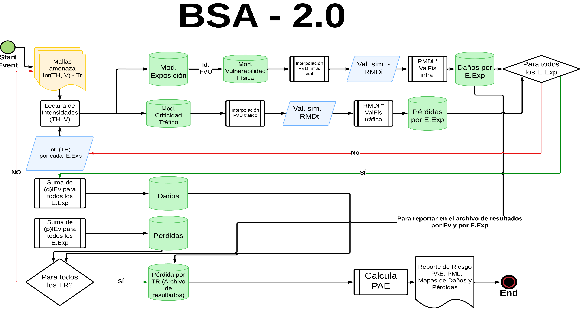
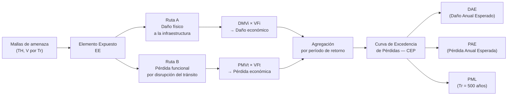
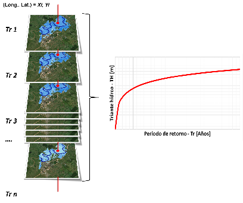
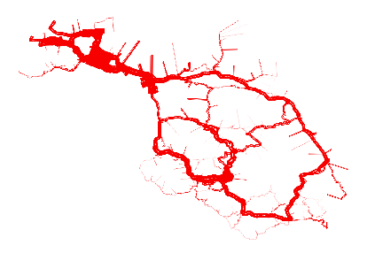

# Lógica funcional y arquitectura

## Sistema modular e integrado

La herramienta BSA 2.0 está concebida como un sistema modular y flexible que integra múltiples fuentes de información geoespacial, climática y funcional para identificar y analizar tramos viales expuestos a amenazas naturales. Su arquitectura combina componentes analíticos independientes con un flujo de trabajo automatizado que genera productos replicables y comparables entre países y regiones.

La lógica funcional se organiza en **cinco módulos principales**:

1. **Amenaza**: caracterización espacial y temporal de las amenazas naturales.
2. **Exposición**: identificación y valoración de la infraestructura expuesta.
3. **Criticidad**: análisis de la importancia funcional de cada tramo de la red.
4. **Vulnerabilidad**: estimación del daño esperado según tipología e intensidad.
5. **Riesgo**: integración de los módulos anteriores para calcular DAE, PAE, PML y CEP.

Un **módulo transversal de arquetipos** de medidas estructurales y no estructurales para la reducción del riesgo complementa el análisis con recomendaciones de intervención.

Cada módulo opera de forma independiente, pero sus resultados se integran en un flujo espacial según la disponibilidad de datos y las prioridades operativas del país.

## Diagrama de flujo de la herramienta

La figura siguiente muestra la secuencia de cálculo para estimar métricas de riesgo sobre elementos de infraestructura vial (ejemplo para amenaza de inundación):

**Figura 1.** Diagrama de flujo de la herramienta BSA 2.0.  
*Fuente: Concept Report BSA 2.0 (BID, 2025).*

El flujo operativo inicia con la **lectura de mallas de amenaza** para distintos períodos de retorno (Tr), que contienen valores de tirante hídrico (TH) y velocidad (V). Estas capas se usan para determinar, para cada elemento expuesto (EE), la intensidad de amenaza correspondiente según su localización espacial.

## Dos rutas de cálculo paralelas

Para cada elemento expuesto y cada malla de amenaza, el BSA 2.0 activa dos rutas de cálculo complementarias:

### Ruta A: daños físicos a la infraestructura

1. Se asigna a cada tipología de infraestructura una **función de vulnerabilidad (FVU)** física, que relaciona la intensidad (TH, V) con el **Daño Medio Vial – Infraestructura (DMVi)**.
2. El DMVi se multiplica por el **Valor Físico de la Infraestructura (VFi)** del tramo:

$$
\text{Daño}_{\text{EE},Tr} = \text{DMVi} \times \text{VFi}
$$

3. Los resultados se almacenan por EE y por Tr.

### Ruta B: pérdidas por disrupción del tránsito

1. Se activa el **Módulo de Criticidad Funcional**, que estima la importancia del tramo (flujo vehicular diario, redundancia, tipo de carga, líneas logísticas).
2. Se selecciona una **FVU para tránsito** que refleje el comportamiento de la funcionalidad vial ante la intensidad del evento.
3. La **Pérdida Media Vial – Tránsito (PMVt)** se multiplica por el **Valor Económico del Tránsito (VFt)**:

$$
\text{Pérdida}_{\text{EE},Tr} = \text{PMVt} \times \text{VFt}
$$

4. Los resultados se almacenan por EE y por Tr.

## Agregación y análisis probabilista

Una vez calculadas ambas rutas para todos los EE y Tr:

1. Se suman los daños (DMVi) y pérdidas (PMVt) de cada EE para cada malla de amenaza, obteniendo el **Daño Medio Vial Total – Infraestructura (DMVTi)** y la **Pérdida Media Vial Total – Tránsito (PMVTt)** por Tr:

$$
\text{DMVTi}_{Tr} = \sum_{i=1}^{n} \text{DMVi}_i \qquad \text{PMVTt}_{Tr} = \sum_{i=1}^{n} \text{PMVt}_i
$$

2. A partir de los valores agregados por Tr se calcula:
   - **DAE**: promedio ponderado por probabilidad de los daños anuales esperados.
   - **PAE**: promedio ponderado por probabilidad de las pérdidas anuales esperadas.
   - **PML**: valor asociado al evento de referencia (ej. $T_r = 500$ años).

## Lectura de intensidades y curva de excedencia

Para cada EE se lee el valor de intensidad en cada malla de amenaza. La figura siguiente ilustra cómo se construye la curva de excedencia de magnitudes de intensidad para un punto particular:

**Figura 2.** Ejemplo de curva de excedencia de magnitudes de intensidad de inundación – Tirante hídrico.  
*Fuente: Olaya et al. (2023), reproducido en Concept Report BSA 2.0 (BID, 2025).*

## Productos de salida

El principal producto de la plataforma es un conjunto de datos georeferenciados desplegable por el usuario según distintas métricas de riesgo. La figura siguiente muestra un ejemplo de resultados de PAE por tramo vial:

**Figura 3.** Representación gráfica de pérdidas anuales esperadas por tramo vial (espesor de línea proporcional a la pérdida).  
*Fuente: Concept Report BSA 2.0 (BID, 2025).*

Además de la representación geoespacial, la plataforma genera:

- **Reportes con listas de priorización** de activos en el inventario.
- **Desagregación de resultados** por tipo de amenaza, módulo o corredor vial.
- **Recomendaciones de intervención** basadas en la comparación de arquetipos de medidas.

## Interoperabilidad

La herramienta opera con formatos estándar de análisis geoespacial (shapefiles, GeoTIFF, CSV, Raster Esri), lo que facilita su interoperabilidad con plataformas como **HydroBID**, **CLIMADA**, **OpenQuake** o sistemas nacionales de información vial.

---

*Véase [Módulo de Amenaza](modulo-amenaza.md) para más detalles sobre los tipos de amenaza implementados.*
