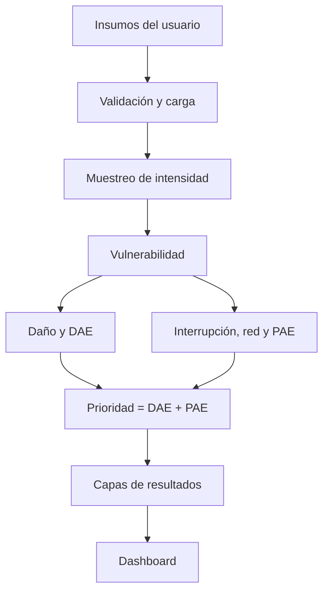

# Lógica funcional y arquitectura

El BSA 2.0 está implementado en Python con ArcPy y se ejecuta desde un toolbox de ArcGIS Pro. La arquitectura separa los insumos preparados externamente del cálculo reproducible.

```mermaid
flowchart TD
    A["Insumos del usuario"] --> B["Validación y carga"]
    B --> C["Muestreo de intensidad"]
    C --> D["Vulnerabilidad"]
    D --> E["Daño y DAE"]
    D --> F["Interrupción, red y PAE"]
    E --> G["Prioridad = DAE + PAE"]
    F --> G
    G --> H["Capas de resultados"]
    H --> I["Dashboard"]
```

## Dos rutas de consecuencia

**Daño físico:** intensidad → RMD → costo de reposición → daño por escenario → integración probabilística → DAE.

**Interrupción:** intensidad → tiempo de interrupción → costo diario del desvío o de viajes no realizados → pérdida por escenario → integración probabilística → PAE.

Los dos indicadores se conservan por separado y sólo se suman al calcular la prioridad.

## Ejecución y trazabilidad

Cada corrida crea copias de resultados para carreteras, puentes, túneles y drenajes dentro de `BSA2.gdb`, con una marca de fecha y hora. También escribe un archivo `.loc` con las rutas y parámetros usados. Las salidas se añaden al mapa activo cuando ArcGIS Pro lo permite.

El dashboard es posterior al cálculo: consume capas publicadas y no vuelve a calcular DAE, PAE ni prioridad.

