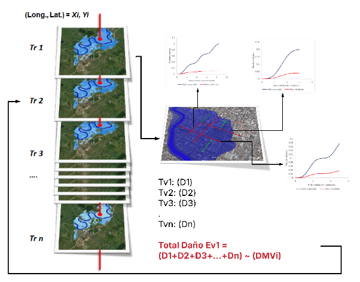

# Risk Calculation

The risk module integrates hazard, exposure, vulnerability, and criticality information to estimate **expected economic damages and losses** from natural events. The adopted approach is a simplified probabilistic estimation, compatible with the data available in the region and with the expected institutional capacities at the national level.

## Definition of risk

Risk is defined as the expectation of loss resulting from the combination of a hazard event, physical exposure, and the vulnerability of affected elements (Merz & Thieken, 2004). The simplest and most widely used mathematical expression is:

$$
R = f(\text{Event}) \times m(\text{Consequences} \mid \text{Event})
$$

where $R$ is the risk per unit of time, $f$ is the event frequency, and $m$ is the magnitude of consequences given the event.

## Types of uncertainty

The risk model recognizes and differentiates three types of uncertainty (de Moel et al., 2010):

| Type | Description |
|---|---|
| **Aleatoric** | Natural variability of the event: intensity or location of a storm |
| **Epistemic** | Lack of knowledge or precision: errors in topography or hydraulic calibration |
| **Ontological** | Impossibility of fully representing the system: urbanization changes not captured |

These uncertainties are managed through probabilistic modeling of the Mean Damage Ratio (MDR). In the initial versions of BSA 2.0, only the expected value of the MDR is used, without explicit uncertainty propagation.

## Adopted risk model

For each combination of exposed element, infrastructure type, and hazard intensity, an MDR value is obtained from the corresponding vulnerability function. The intensity indicators are:

- **TH and V** for floods.
- **PGA** for earthquakes.
- Susceptibility index or movement velocity for liquefaction.

## Simplified probabilistic estimation process

For each exposed element (EE) and each return period (Tr):

1. The intensity value in the corresponding hazard grid is identified.
2. The vulnerability function (VF) is applied to obtain the MDR.
3. Damage or loss is calculated by multiplying the MDR by the economic value of the asset:

**Route A — Physical damage:**

$$
\text{Damage}_{\text{EE}, Tr} = \text{MDR}_{\text{infra}}(TH, V) \times VFi
$$

**Route B — Functional loss:**

$$
\text{Loss}_{\text{EE}, Tr} = \text{MDR}_{\text{transit}}(TH, V) \times VFt
$$

4. Damage (or loss) is aggregated across all EEs to obtain total damage/loss per return period:

$$
\text{DMVTi}_{Tr} = \sum_{i=1}^{n} \text{Damage}_{i, Tr}
$$

$$
\text{PMVTt}_{Tr} = \sum_{i=1}^{n} \text{Loss}_{i, Tr}
$$

The following figure illustrates this loss generation process by event:

**Figure 1.** Loss generation by event scheme.  
*Source: Olaya et al. (2020, 2023); UNGRD (2018), reproduced in BSA 2.0 Concept Report (IDB, 2025).*

## Loss Exceedance Curve (LEC)

The **Loss Exceedance Curve** specifies the average number of times per year that a specific loss will be equaled or exceeded. The exceedance rate of loss $p$ is defined as (Esteva, 1967, in Torres et al., 2014):

$$
\nu(p) = \sum_{k=1}^{N} P(P > p \mid \text{Event } k) \cdot f_{aoc}(\text{Event } k)
$$

where:

- $\nu(p)$ = annual exceedance rate of loss $p$
- $N$ = total number of hazard events considered (one per return period)
- $P(P > p \mid \text{Event } k)$ = probability that loss exceeds $p$ given event $k$
- $f_{aoc}(\text{Event } k)$ = annual occurrence frequency of event $k$ = $1 / T_{r,k}$

In BSA 2.0's simplified approach, the LEC is constructed from the (estimated loss, exceedance frequency) pairs for each available return period (typically: 10, 50, 100, 200, 500 years).

## EAD: Expected Annual Damage

**EAD** is obtained by integrating the area under the damage exceedance curve. In discrete practice:

$$
\text{EAD} \approx \sum_{i=1}^{n-1} \frac{D_i + D_{i+1}}{2} \cdot \left(\frac{1}{T_{r,i}} - \frac{1}{T_{r,i+1}}\right)
$$

where $D_i$ is the total estimated damage for return period $T_{r,i}$ and the term in parentheses is the difference in annual exceedance frequencies between consecutive levels.

## EAL: Expected Annual Loss

**EAL** is calculated with the same formula, using functional loss $L_i$ instead of damage $D_i$:

$$
\text{EAL} \approx \sum_{i=1}^{n-1} \frac{L_i + L_{i+1}}{2} \cdot \left(\frac{1}{T_{r,i}} - \frac{1}{T_{r,i+1}}\right)
$$

## PML: Probable Maximum Loss

**PML** corresponds to the estimated damage or loss for the **reference design event**, typically $T_r = 500$ years. It is read directly from the LEC at the point corresponding to that exceedance frequency ($\lambda = 1/500 = 0.002$ per year).

## Applicability and limitations of the simplified approach

The simplified probabilistic approach of BSA 2.0 seeks the balance between technical rigor and operational feasibility:

**Suitable for:**

- Prioritization of investments in road infrastructure.
- Identification of bottlenecks and critical segments in the network.
- Comparison of scenarios with and without climate change.
- Strategic planning at national or regional scale.

**Limitations:**

- Does not model the statistical dispersion of damage (only expected value of MDR).
- Does not generate complete loss distributions for extreme-value analysis.
- Does not replace detailed dynamic models for structural design.

!!! warning "Interpretation of results"
    The EAD and EAL values from BSA 2.0 are estimates of the **annual average**, not the maximum possible. For insurance analysis or financial design that require quantiles of the distribution, a complete probabilistic analysis with uncertainty simulation is recommended.

---

*To see the output products generated with these metrics, see [Results](../guia-usuario/resultados.md).*
