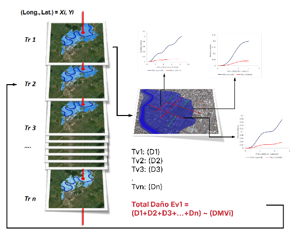

# Cálculo de Riesgo

El módulo de riesgo integra la información de amenaza, exposición, vulnerabilidad y criticidad para estimar los **daños y pérdidas económicas esperadas** derivadas de eventos de origen natural. El enfoque adoptado es una estimación probabilista simplificada, compatible con los datos disponibles en la región y con las capacidades institucionales esperadas a nivel nacional.

## Definición de riesgo

El riesgo se define como la expectativa de pérdida resultante de la combinación de un evento de amenaza, la exposición física y la vulnerabilidad de los elementos afectados (Merz & Thieken, 2004). La expresión matemática más sencilla y ampliamente difundida es:

$$
R = f(\text{Evento}) \times m(\text{Consecuencias} \mid \text{Evento})
$$

donde $R$ es el riesgo por unidad de tiempo, $f$ es la frecuencia del evento y $m$ es la magnitud de las consecuencias dado el evento.

## Tipos de incertidumbre

El modelo de riesgo reconoce y diferencia tres tipos de incertidumbre (de Moel et al., 2010):

| Tipo | Descripción |
|---|---|
| **Aleatoria** | Variabilidad natural del evento: intensidad o localización de una tormenta |
| **Epistémica** | Falta de conocimiento o precisión: errores en topografía o calibración hidráulica |
| **Ontológica** | Imposibilidad de representar completamente el sistema: cambios en urbanización no capturados |

Estas incertidumbres se manejan mediante la modelación probabilista de la Relación Media de Daño (RMD). En las versiones iniciales del BSA 2.0, se utiliza únicamente el valor esperado de la RMD, sin propagación explícita de la incertidumbre.

## Modelo de riesgo adoptado

Para cada combinación de elemento expuesto, tipo de infraestructura e intensidad de amenaza, se obtiene un valor de RMD a partir de la función de vulnerabilidad correspondiente. Los indicadores de intensidad son:

- **TH y V** para inundaciones.
- **PGA** para sismos.
- Índice de susceptibilidad o velocidad de movimiento para licuefacción.

## Proceso de estimación probabilista simplificada

Para cada elemento expuesto (EE) y cada período de retorno (Tr):

1. Se identifica el valor de intensidad en la malla de amenaza correspondiente.
2. Se aplica la función de vulnerabilidad (FVU) para obtener la RMD.
3. Se calcula el daño o pérdida multiplicando la RMD por el valor económico del activo:

**Ruta A — Daño físico:**

$$
\text{Daño}_{\text{EE}, Tr} = \text{RMD}_{\text{infra}}(TH, V) \times VFi
$$

**Ruta B — Pérdida funcional:**

$$
\text{Pérdida}_{\text{EE}, Tr} = \text{RMD}_{\text{tránsito}}(TH, V) \times VFt
$$

4. Se agrega el daño (o pérdida) sobre todos los EE para obtener el daño/pérdida total por período de retorno:

$$
\text{DMVTi}_{Tr} = \sum_{i=1}^{n} \text{Daño}_{i, Tr}
$$

$$
\text{PMVTt}_{Tr} = \sum_{i=1}^{n} \text{Pérdida}_{i, Tr}
$$

La figura siguiente ilustra este proceso de generación de pérdidas por evento:

**Figura 1.** Esquema de generación de pérdidas por evento.  
*Fuente: Olaya et al. (2020, 2023); UNGRD (2018), reproducido en Concept Report BSA 2.0 (BID, 2025).*

## Curva de Excedencia de Pérdidas (CEP)

La **Curva de Excedencia de Pérdidas** especifica el número promedio de veces al año en que una pérdida específica será igualada o excedida. La tasa de excedencia de la pérdida $p$ se define como (Esteva, 1967, en Torres et al., 2014):

$$
\nu(p) = \sum_{k=1}^{N} P(P > p \mid \text{Evento } k) \cdot f_{aoc}(\text{Evento } k)
$$

donde:

- $\nu(p)$ = tasa anual de excedencia de la pérdida $p$
- $N$ = número total de eventos de amenaza considerados (uno por período de retorno)
- $P(P > p \mid \text{Evento } k)$ = probabilidad de que la pérdida exceda $p$ dado el evento $k$
- $f_{aoc}(\text{Evento } k)$ = frecuencia anual de ocurrencia del evento $k$ = $1 / T_{r,k}$

En el enfoque simplificado del BSA 2.0, la CEP se construye a partir de los pares (pérdida estimada, frecuencia de excedencia) para cada período de retorno disponible (tipicamente: 10, 50, 100, 200, 500 años).

## DAE: Daño Anual Esperado

El **DAE** se obtiene integrando el área bajo la curva de excedencia de daños. En la práctica discreta:

$$
\text{DAE} \approx \sum_{i=1}^{n-1} \frac{D_i + D_{i+1}}{2} \cdot \left(\frac{1}{T_{r,i}} - \frac{1}{T_{r,i+1}}\right)
$$

donde $D_i$ es el daño total estimado para el período de retorno $T_{r,i}$ y el término entre paréntesis es la diferencia en frecuencias anuales de excedencia entre niveles consecutivos.

## PAE: Pérdida Anual Esperada

La **PAE** se calcula con la misma fórmula, usando la pérdida funcional $L_i$ en lugar del daño $D_i$:

$$
\text{PAE} \approx \sum_{i=1}^{n-1} \frac{L_i + L_{i+1}}{2} \cdot \left(\frac{1}{T_{r,i}} - \frac{1}{T_{r,i+1}}\right)
$$

## PML: Pérdida Máxima Probable

La **PML** corresponde al daño o pérdida estimado para el **evento de diseño de referencia**, típicamente $T_r = 500$ años. Se lee directamente de la CEP en el punto correspondiente a esa frecuencia de excedencia ($\lambda = 1/500 = 0.002$ por año).

## Aplicabilidad y limitaciones del enfoque simplificado

El enfoque probabilista simplificado del BSA 2.0 busca el equilibrio entre rigor técnico y viabilidad operativa:

**Adecuado para:**

- Priorización de inversiones en infraestructura vial.
- Identificación de cuellos de botella y tramos críticos en la red.
- Comparación de escenarios con y sin cambio climático.
- Planificación estratégica a escala nacional o regional.

**Limitaciones:**

- No modela la dispersión estadística del daño (solo valor esperado de la RMD).
- No genera distribuciones completas de pérdidas para análisis de extremos.
- No reemplaza modelos dinámicos detallados para diseño estructural.

!!! warning "Interpretación de los resultados"
    Los valores de DAE y PAE del BSA 2.0 son estimaciones del **promedio anual**, no del máximo posible. Para análisis de aseguramiento o diseño financiero que requieren cuantiles de la distribución, se recomienda un análisis probabilístico completo con simulación de incertidumbre.

---

*Para ver los productos de salida que se generan con estas métricas, véase [Resultados](../guia-usuario/resultados.md).*
