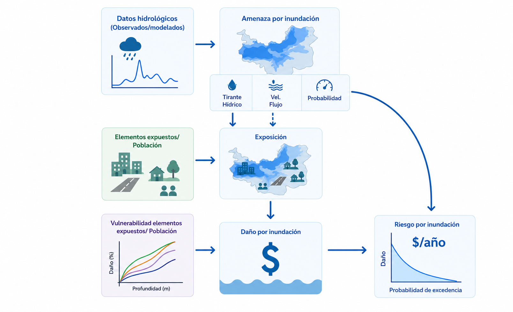
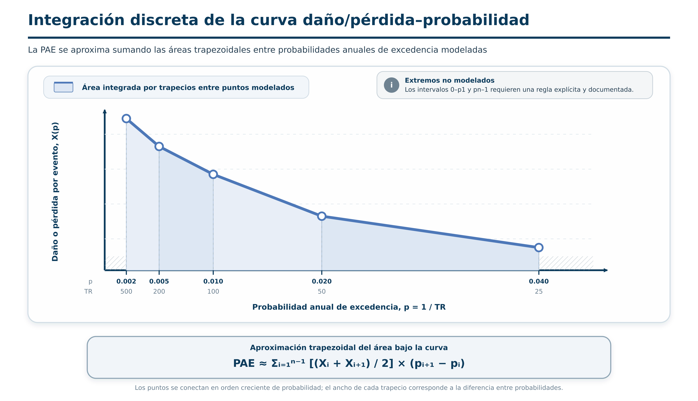

# Cálculo de riesgo

## Modelo adoptado

El BSA 2.0 utiliza un modelo probabilístico simplificado: calcula consecuencias para períodos de retorno discretos y aproxima el valor anual esperado mediante integración numérica. No crea catálogos estocásticos ni propaga toda la incertidumbre epistemológica y aleatoria.

## Consecuencia por escenario

Para cada amenaza (h), período de retorno (TR_i) y activo:

- el **daño** es la RMD multiplicada por el costo de reposición;
- la **pérdida operacional** es el costo diario de interrupción multiplicado por (T/24).

La probabilidad anual de excedencia es:

$$p_i=\frac{1}{TR_i}$$

## Integración discreta

Los pares ((p_i,C_i)) se ordenan por probabilidad y se integran entre puntos consecutivos con la regla trapezoidal. La implementación actual añade además el término (p_{min}C(p_{min})) para representar la cola entre la menor probabilidad modelada y cero:

$$E[C]\approx\sum_{i=1}^{n-1}\frac{C_i+C_{i+1}}{2}(p_{i+1}-p_i)+p_{min}C(p_{min})$$

Aplicada a los daños produce `DAE_{amenaza}`; aplicada a las pérdidas por interrupción produce `PAE_{amenaza}`.

!!! note
    Con menos de dos períodos de retorno válidos para una amenaza, la implementación asigna cero a su valor anual esperado. La regla de cola debe conservarse documentada al comparar con otros modelos.

## Agregación

En carreteras:

- `DAE`: daño anual esperado de la propia línea;
- `DAE_bridge`, `DAE_tunnel`, `DAE_drainage`: DAE de activos puntuales asociados;
- `DAE_total`: suma de los cuatro componentes;
- `PAE_total`: suma de PAE por amenaza;
- `Priority`: `DAE_total + PAE_total`.

El código actual también asigna PAE y prioridad a puentes, túneles y drenajes usando el costo diario del tramo al que se vinculan mediante `ID_TRAMO` y su propio tiempo de interrupción. Este comportamiento debe tenerse en cuenta para evitar sumar varias veces resultados de distinta unidad de análisis.

## Alcance

DAE y PAE se expresan en la moneda utilizada en los costos, por año. No son probabilidades ni puntajes. La versión actual no calcula PML. Los resultados son comparables sólo si moneda, año base, cobertura de amenazas, períodos de retorno y reglas de valoración son homogéneos.

