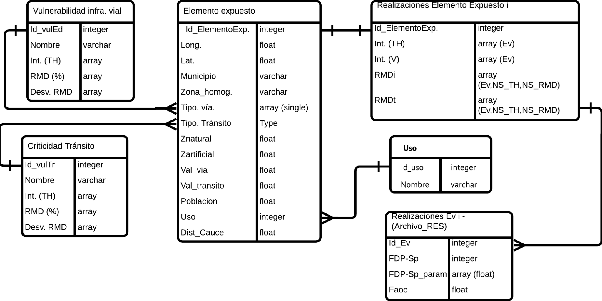
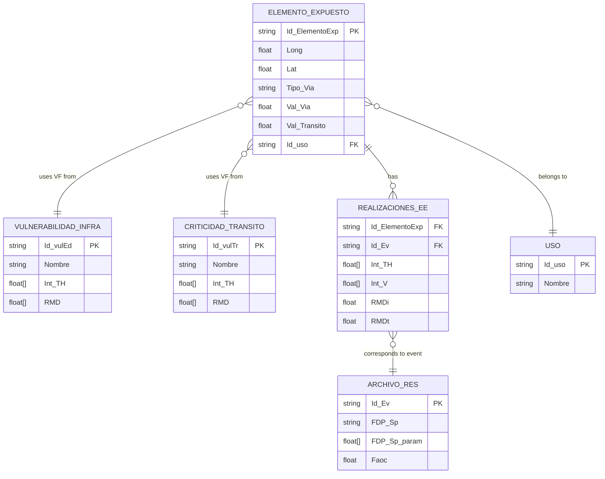

# Data Structure

The BSA 2.0 tool is based on a modular architecture that requires a robust, normalized data structure prepared to operate with multi-scenario simulations. This section presents the **relational model** that organizes the key system information: from the characterization of exposed elements to the structured storage of simulation results.

## Entity-relationship diagram

The following figure shows the entity-relationship diagram of the BSA 2.0 conceptual database:

**Figure 1.** BSA 2.0 tool data structure.  
*Source: BSA 2.0 Concept Report (IDB, 2025).*

This model systematically links:

- The spatial and functional characterization of the road network → **Exposed element** table.
- Physical and functional vulnerability functions → **Road infra. vulnerability** and **Transit criticality** tables.
- Simulation results by event and element → **EE Realizations I** and **Results_File** tables.
- The territorial use context of the road element → **Use** table.

This structure ensures that all damage and loss calculations are traceable, updatable, and aggregable by return period, road type, or administrative jurisdiction.

## Main tables

### Exposed element

Contains the individual characterization of each road segment discretized as a point (EE). It is the central table of the model.

| Field | Description |
|---|---|
| `Id_ElementoExp` | Unique identifier of the EE |
| `Long`, `Lat` | Geographic coordinates (WGS84) |
| `Municipio`, `Zona_homog` | Administrative and sectoral location |
| `Tipo_Via`, `Tipo_Transito` | Functional classification |
| `Znatural`, `Zartificial` | Natural and modified elevation (m a.s.l.) |
| `Val_Via` (VFi) | Physical value of the infrastructure |
| `Val_Transito` (VFt) | Economic transit value through the EE |
| `Poblacion` | Population served or influenced |
| `Uso` | Use code (foreign key → Use table) |
| `Dist_Cauce` | Distance to the nearest watercourse (m) |

### Road infrastructure vulnerability

Stores the physical vulnerability functions (VF) applied according to infrastructure type.

| Field | Description |
|---|---|
| `Id_vulEd` | Vulnerability function identifier |
| `Nombre` | Description or category of the VF |
| `Int_TH` | Array of simulated intensities (water depth) |
| `RMD` (%) | Mean damage values (MDRi) per intensity |
| `Desv_RMD` | Standard deviation for probabilistic use |

### Transit criticality

Defines the functional vulnerability functions (VF for transit) that quantify losses from disruption.

| Field | Description |
|---|---|
| `Id_vulTr`, `Nombre` | Identifier and description of the transit VF |
| `Int_TH` | Intensities considered |
| `RMD` (%) | Mean loss values (MDRt) |
| `Desv_RMD` | Expected variability |

### Exposed Element Realizations I

Records simulation results per EE, including intensities and MDR values obtained for each event.

| Field | Description |
|---|---|
| `Id_ElementoExp` | EE identifier (foreign key) |
| `Int_TH`, `Int_V` | Arrays of intensities per event |
| `RMDi`, `RMDt` | Mean damages obtained for infrastructure and transit |
| `Ev`, `NS_TH` | Indices per event and intensity level |

### Event Realizations I (Results\_File)

Master simulation file. Collects and organizes global results by event.

| Field | Description |
|---|---|
| `Id_Ev` | Event identifier (return period) |
| `FDP-Sp` | Type of probability distribution function used |
| `FDP-Sp_param` | Associated parameters (mean, variance) |
| `Faoc` | Operational or corrective adjustment factor |

### Use

Reference table for classifying the EE's environment.

| Field | Description |
|---|---|
| `Id_uso` | Category identifier |
| `Nombre` | Textual description (urban, rural, coastal, etc.) |

## Relationships between tables

Each **Exposed element** is linked to:

- An entry in **Road infra. vulnerability** (by road type).
- An entry in **Transit criticality** (by transit type).
- A **Use** category.

**EE Realizations I** stores results per EE, connecting:

- With the input parameters (event intensities).
- With the vulnerability functions applied.
- With the events defined in **Results\_File**.

This structure allows complete tracing of each calculation, facilitates result traceability, and enables aggregation of damages and losses for different analytical and planning purposes.

---

*To see how this structure is used in practice when configuring an analysis run, see [Configuring a run](../guia-usuario/configuracion-corrida.md).*
