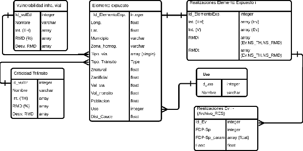
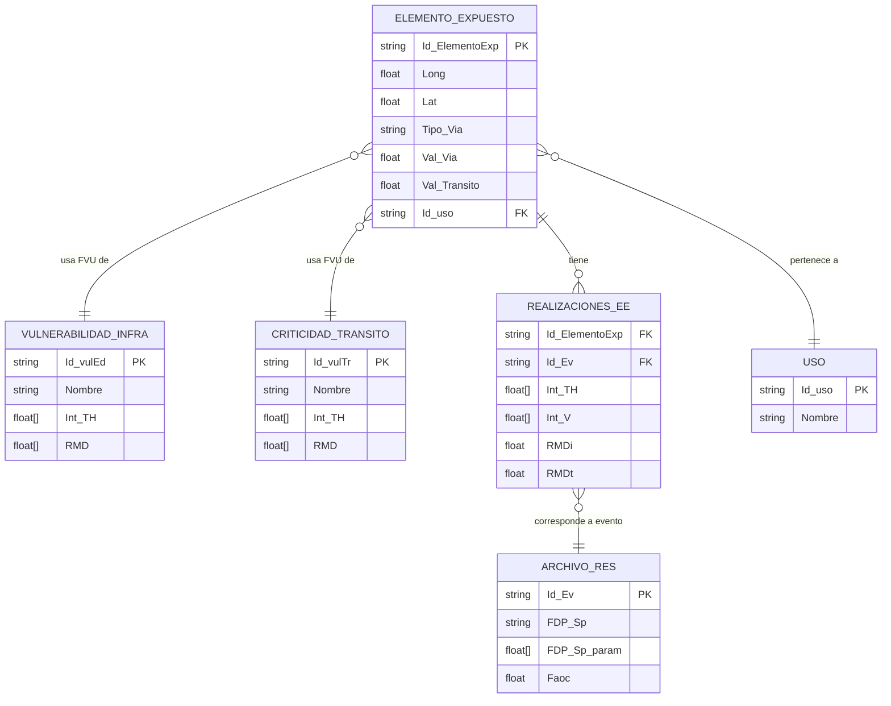

# Estructura de datos

La herramienta BSA 2.0 se basa en una arquitectura modular que requiere una estructura de datos robusta, normalizada y preparada para operar con simulaciones multi-escenario. Esta sección presenta el **modelo relacional** que organiza la información clave del sistema: desde la caracterización de los elementos expuestos hasta el almacenamiento estructurado de los resultados de simulación.

## Diagrama entidad-relación

La figura siguiente muestra el diagrama de entidades y relaciones de la base de datos conceptual del BSA 2.0:

**Figura 1.** Estructura de datos de la herramienta BSA 2.0.  
*Fuente: Concept Report BSA 2.0 (BID, 2025).*

Este modelo vincula sistemáticamente:

- La caracterización espacial y funcional de la red vial → tabla **Elemento expuesto**.
- Las funciones de vulnerabilidad física y funcional → tablas **Vulnerabilidad infra. vial** y **Criticidad tránsito**.
- Los resultados de simulación por evento y elemento → tablas **Realizaciones EE I** y **Archivo\_RES**.
- El contexto de uso territorial del elemento vial → tabla **Uso**.

Esta estructura garantiza que todos los cálculos de daños y pérdidas sean trazables, actualizables y agregables por período de retorno, tipo de vía o jurisdicción administrativa.

## Tablas principales

### Elemento expuesto

Contiene la caracterización individual de cada tramo vial discretizado como punto (EE). Es la tabla central del modelo.

| Campo | Descripción |
|---|---|
| `Id_ElementoExp` | Identificador único del EE |
| `Long`, `Lat` | Coordenadas geográficas (WGS84) |
| `Municipio`, `Zona_homog` | Ubicación administrativa y sectorial |
| `Tipo_Via`, `Tipo_Transito` | Clasificación funcional |
| `Znatural`, `Zartificial` | Altimetría natural y modificada (m s.n.m.) |
| `Val_Via` (VFi) | Valor físico de la infraestructura |
| `Val_Transito` (VFt) | Valor económico del tránsito por el EE |
| `Poblacion` | Población servida o influenciada |
| `Uso` | Código de uso (clave foránea → tabla Uso) |
| `Dist_Cauce` | Distancia al cauce más cercano (m) |

### Vulnerabilidad infraestructura vial

Almacena las funciones de vulnerabilidad física (FVU) aplicadas según el tipo de infraestructura.

| Campo | Descripción |
|---|---|
| `Id_vulEd` | Identificador de la función de vulnerabilidad |
| `Nombre` | Descripción o categoría de la FVU |
| `Int_TH` | Array de intensidades simuladas (tirante hídrico) |
| `RMD` (%) | Valores de daño medio (DMVi) por intensidad |
| `Desv_RMD` | Desviación estándar para uso probabilista |

### Criticidad tránsito

Define las funciones de vulnerabilidad funcional (FVU para tránsito) que cuantifican pérdidas por disrupción.

| Campo | Descripción |
|---|---|
| `Id_vulTr`, `Nombre` | Identificador y descripción de la FVU de tránsito |
| `Int_TH` | Intensidades consideradas |
| `RMD` (%) | Valores de pérdida media (DMVt) |
| `Desv_RMD` | Variabilidad esperada |

### Realizaciones Elemento Expuesto I

Registra los resultados de simulación por EE, incluyendo las intensidades y los valores de RMD obtenidos para cada evento.

| Campo | Descripción |
|---|---|
| `Id_ElementoExp` | Identificador del EE (clave foránea) |
| `Int_TH`, `Int_V` | Arrays de intensidades por evento |
| `RMDi`, `RMDt` | Daños medios obtenidos para infraestructura y tránsito |
| `Ev`, `NS_TH` | Índices por evento y nivel de intensidad |

### Realizaciones Ev I (Archivo\_RES)

Archivo maestro de simulaciones. Recoge y organiza los resultados globales por evento.

| Campo | Descripción |
|---|---|
| `Id_Ev` | Identificador del evento (período de retorno) |
| `FDP-Sp` | Tipo de función de distribución de probabilidad usada |
| `FDP-Sp_param` | Parámetros asociados (media, varianza) |
| `Faoc` | Factor de ajuste operacional o correctivo |

### Uso

Tabla de referencia para clasificar el entorno del EE.

| Campo | Descripción |
|---|---|
| `Id_uso` | Identificador de categoría |
| `Nombre` | Descripción textual (urbano, rural, costero, etc.) |

## Relaciones entre tablas

Cada **Elemento expuesto** se vincula a:

- Una entrada en **Vulnerabilidad infra. vial** (por tipo de vía).
- Una entrada en **Criticidad tránsito** (por tipo de tránsito).
- Una categoría de **Uso**.

Las **Realizaciones EE I** almacenan los resultados por EE, conectando:

- Con los parámetros de entrada (intensidades del evento).
- Con las funciones de vulnerabilidad aplicadas.
- Con los eventos definidos en **Archivo\_RES**.

Esta estructura permite rastrear completamente cada cálculo, facilita la trazabilidad de los resultados y habilita la agregación de daños y pérdidas para distintos fines analíticos y de planificación.

---

*Para ver cómo esta estructura se usa en la práctica al configurar una corrida de análisis, véase [Configuración de una corrida](../guia-usuario/configuracion-corrida.md).*
