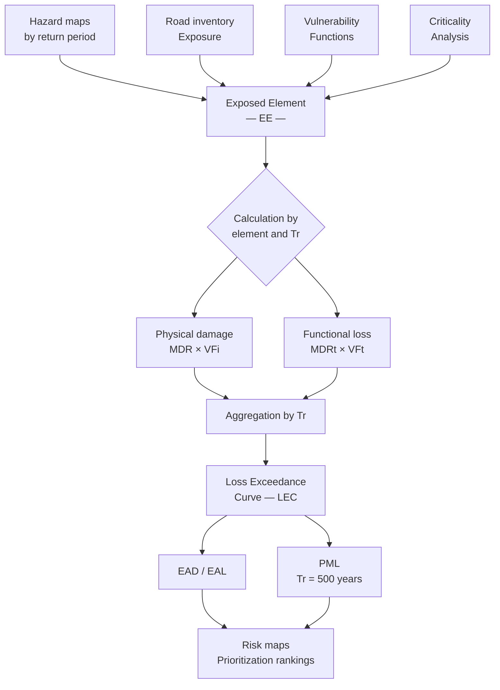

# BSA 2.0 Methodology

The **Blue Spot Analysis 2.0** (BSA 2.0) is a risk assessment and prioritization tool for transport infrastructure against natural hazards. Developed by the Inter-American Development Bank (IDB), it combines four analytical components to estimate, in economic terms, the risk to which a national or regional road network is exposed.

The methodology adopts a **simplified probabilistic approach**: rather than simulating exhaustive event catalogs, it draws on hazard intensity grids associated with discrete return periods, and estimates expected damage and loss through numerical integration. This balance between technical rigor and operational feasibility makes it applicable in contexts with variable data availability, which is the typical situation in Latin America and the Caribbean.

## The four components

| Component | Question it answers | Primary metric |
|---|---|---|
| **Hazard** | How intense and frequent is the phenomenon? | Intensity by return period (TH, V, PGA…) |
| **Exposure** | What infrastructure is within the impact zone? | Georeferenced inventory + economic value (VFi, VFt) |
| **Vulnerability** | How much is an asset damaged at a given intensity? | Mean Damage Ratio — MDR (% of physical value) |
| **Criticality** | How important is this asset to the network? | Multi-criteria score (flow, redundancy, accessibility) |

The integration of these four components produces two families of risk metrics:

- **EAD — Expected Annual Damage** (*DAE* in Spanish): direct physical damage to infrastructure, expressed in monetary units per year.
- **EAL — Expected Annual Loss** (*PAE* in Spanish): economic loss from service or traffic disruption, expressed in monetary units per year.

!!! note "Fundamental distinction"
    *Damage* and *loss* are not synonyms in the BSA 2.0. **Damage** is physical (asset replacement cost). **Loss** is functional (economic cost of traffic disruption). This distinction is essential for correctly interpreting results and prioritizing interventions.

## General methodology flow

*Source: own elaboration based on BSA 2.0 Concept Report (IDB, 2025).*

## Countries of implementation

BSA 2.0 is currently implemented in three countries:

- **Dominican Republic** — reference case, basis of the online dashboard.
- **Costa Rica** — second implementation.
- **El Salvador** — third implementation.

## Sections of this methodological guide

- :material-history: **[Background](antecedentes.md)**  
  Origins of BSA (Danish Road Directorate, SWAMP project) and evolution to BSA 2.0.

- :material-target: **[Purpose and scope](proposito-alcances.md)**  
  Questions the tool answers, scales of application, and limitations.

- :material-book-open-variant: **[Key concepts](conceptos-clave.md)**  
  Technical glossary: hazard, exposure, vulnerability, criticality, EAD, EAL, PML, return periods.

- :material-sitemap: **[Architecture and modules](arquitectura.md)**  
  Functional logic by module and complete calculation flow.

- :material-weather-hurricane: **[Hazard Module](modulo-amenaza.md)**  
  Types of hazard implemented and representation methodology.

- :material-road: **[Exposure Module](modulo-exposicion.md)**  
  Characterization, segmentation, and valuation of infrastructure.

- :material-chart-bell-curve: **[Vulnerability Module](modulo-vulnerabilidad.md)**  
  Vulnerability functions and modular damage library.

- :material-traffic-light: **[Criticality Module](modulo-criticidad.md)**  
  Multi-criteria analysis of road network importance.

- :material-calculator: **[Risk Calculation](calculo-riesgo.md)**  
  Simplified probabilistic model: EAD, EAL, LEC, and PML.

- :material-database: **[Data structure](estructura-datos.md)**  
  Relational model, tables, and system fields.

