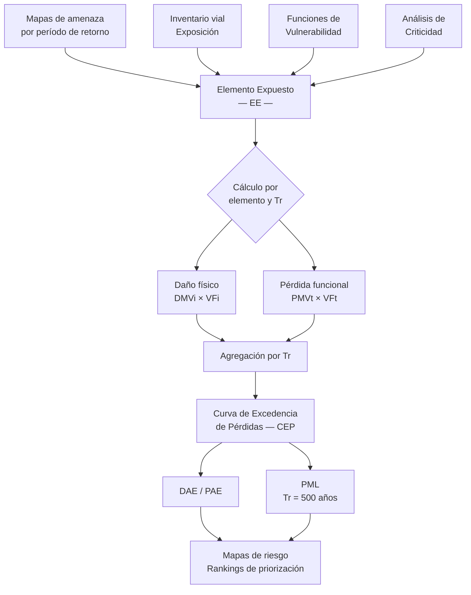

# Metodología BSA 2.0

El **Blue Spot Analysis 2.0** (BSA 2.0) es una herramienta de evaluación y priorización de riesgos para infraestructura de transporte ante amenazas naturales. Desarrollada por el Banco Interamericano de Desarrollo (BID), combina cuatro componentes analíticos para estimar, en términos económicos, el riesgo al que está expuesta una red vial nacional o regional.

La metodología adopta un **enfoque probabilista simplificado**: en lugar de simular catálogos exhaustivos de eventos, parte de mallas de intensidad de amenaza asociadas a períodos de retorno discretos, y estima el daño y la pérdida esperados mediante integración numérica. Este balance entre rigor técnico y viabilidad operativa la hace aplicable en contextos con disponibilidad variable de datos, que es la situación habitual en América Latina y el Caribe.

## Los cuatro componentes

| Componente | Pregunta que responde | Métrica principal |
|---|---|---|
| **Amenaza** | ¿Qué tan intenso y frecuente es el fenómeno? | Intensidad por período de retorno (TH, V, PGA…) |
| **Exposición** | ¿Qué infraestructura está en la zona de impacto? | Inventario georeferenciado + valor económico (VFi, VFt) |
| **Vulnerabilidad** | ¿Cuánto se daña un activo ante determinada intensidad? | Relación Media de Daño — RMD (% del valor físico) |
| **Criticidad** | ¿Cuán importante es ese activo para la red? | Puntaje multicriterio (flujo, redundancia, accesibilidad) |

La integración de estos cuatro componentes produce dos familias de métricas de riesgo:

- **DAE — Daño Anual Esperado** (*EAD*): daño físico directo a la infraestructura, expresado en unidades monetarias por año.
- **PAE — Pérdida Anual Esperada** (*EAL*): pérdida económica por interrupción del servicio o del tránsito, expresada en unidades monetarias por año.

!!! note "Distinción fundamental"
    *Daño* y *pérdida* no son sinónimos en el BSA 2.0. El **daño** es físico (costo de reposición del activo). La **pérdida** es funcional (costo económico de la interrupción del tránsito). Esta diferencia es esencial para interpretar correctamente los resultados y priorizar intervenciones.

## Flujo general de la metodología

*Fuente: elaboración propia a partir del Concept Report BSA 2.0 (BID, 2025).*

## Países de implementación

El BSA 2.0 está actualmente implementado en tres países:

- **República Dominicana** — caso de referencia, base del dashboard en línea.
- **Costa Rica** — segunda implementación.
- **El Salvador** — tercera implementación.

## Secciones de esta guía metodológica

- :material-history: **[Antecedentes](antecedentes.md)**  
  Origen del BSA (Danish Road Directorate, proyecto SWAMP) y evolución hacia el BSA 2.0.

- :material-target: **[Propósito y alcances](proposito-alcances.md)**  
  Preguntas que responde la herramienta, escalas de aplicación y limitaciones.

- :material-book-open-variant: **[Conceptos clave](conceptos-clave.md)**  
  Glosario técnico: amenaza, exposición, vulnerabilidad, criticidad, DAE, PAE, PML, períodos de retorno.

- :material-sitemap: **[Arquitectura y módulos](arquitectura.md)**  
  Lógica funcional por módulos y flujo de cálculo completo.

- :material-weather-hurricane: **[Módulo de Amenaza](modulo-amenaza.md)**  
  Tipos de amenaza implementados y metodología de representación.

- :material-road: **[Módulo de Exposición](modulo-exposicion.md)**  
  Caracterización, segmentación y valoración de la infraestructura.

- :material-chart-bell-curve: **[Módulo de Vulnerabilidad](modulo-vulnerabilidad.md)**  
  Funciones de vulnerabilidad y librería modular de daño.

- :material-traffic-light: **[Módulo de Criticidad](modulo-criticidad.md)**  
  Análisis multicriterio de importancia de la red vial.

- :material-calculator: **[Cálculo de Riesgo](calculo-riesgo.md)**  
  Modelo probabilista simplificado: DAE, PAE, CEP y PML.

- :material-database: **[Estructura de datos](estructura-datos.md)**  
  Modelo relacional, tablas y campos del sistema.

