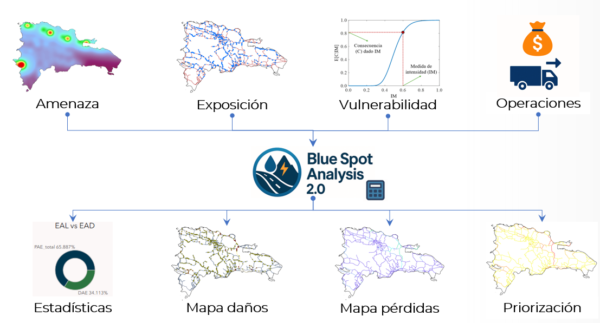

# Metodología BSA 2.0

La metodología organiza el análisis en siete componentes conectados. Cada capítulo explica primero la lógica de cálculo y luego el contrato de datos que debe cumplir el usuario.

| Componente | Pregunta | Resultado principal |
|---|---|---|
| Amenaza | ¿Con qué intensidad y probabilidad puede ocurrir cada fenómeno? | Mallas de intensidad por amenaza y período de retorno. |
| Exposición | ¿Qué activos integran la red analizada? | Carreteras, puentes, túneles y drenajes georreferenciados. |
| Vulnerabilidad | ¿Qué daño e interrupción produce cada intensidad? | Relaciones intensidad–RMD e intensidad–tiempo. |
| Criticidad | ¿Qué consecuencia funcional genera interrumpir un tramo? | Costo diario de desvío o de viajes no realizados. |
| Riesgo | ¿Cuánto daño y pérdida se espera anualmente? | DAE y PAE. |
| Priorización | ¿Dónde se concentran las consecuencias económicas? | `Priority = DAE_total + PAE_total`. |
| Tablero | ¿Cómo se consultan y comunican los resultados? | Mapas, filtros, gráficos y fichas. |

## Principios de aplicación

- **Trazabilidad:** conservar fuente, versión, fecha y transformaciones de cada insumo.
- **Comparabilidad:** aplicar reglas homogéneas dentro del universo analizado.
- **Modularidad:** actualizar componentes sin perder las interfaces de datos.
- **Adecuación:** no atribuir a los resultados mayor precisión que a sus insumos.
- **Interpretación responsable:** usar los resultados como apoyo, no como diseño definitivo.

Todos los insumos espaciales deben estar en coordenadas geográficas WGS 84, **`EPSG:4326`**.

