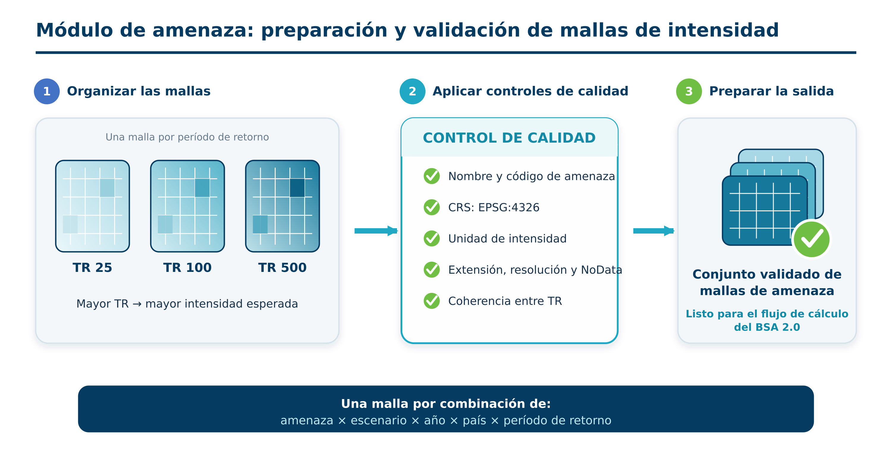

# Módulo de amenaza

## Función del módulo

El módulo recibe mallas de intensidad elaboradas fuera del BSA 2.0, comprueba que puedan incorporarse al flujo y las asocia con los activos expuestos. **No ejecuta modelos hidrológicos, hidráulicos, costeros, sísmicos ni climáticos.**



## Amenazas e intensidades

| Amenaza | Código documental | Intensidad | Unidad |
|---|---:|---|---|
| Inundación pluvial | `pl` | Tirante de agua | m |
| Inundación fluvial | `ri` | Tirante de agua | m |
| Inundación costera | `co` | Tirante de agua | m |
| Tsunami | `ts` | Tirante de agua | m |
| Sismo | `eq` | PGA o aceleración espectral `SA##` | g |
| Licuefacción | `li` | Susceptibilidad: 1 baja, 2 media, 3 alta, 4 muy alta | clase |

La interfaz actual dispone de grupos multivalor para **inundación fluvial, inundación costera, tsunami y sismo**. La licuefacción se carga como una sola capa complementaria del análisis sísmico. No existe un cuadro independiente para inundación pluvial en la versión actual.

## Contrato de datos

Cada malla principal debe cumplir:

| Propiedad | Especificación |
|---|---|
| Formato | GeoTIFF (`.tif`) |
| Tipo de dato | `Float32` para intensidades continuas |
| Referencia espacial | WGS 84, `EPSG:4326` |
| NoData | Valor explícito y consistente |
| Cobertura y alineación | Compatibles dentro del conjunto analizado |
| Período de retorno | Identificable en el nombre del archivo |

Convención documental recomendada:

```text
{amenaza}_{escenario}_{año}_{país}_TR{periodo}.tif
```

Ejemplo: `ri_ssp245_2050_gt_TR100.tif`.

Los escenarios CMIP6 se codifican como `ssp126`, `ssp245`, `ssp370` y `ssp585`. El código del país debe ser único y documentarse en el proyecto.

!!! warning "Cómo interpreta el código actual los nombres"
    El toolbox asocia el tipo de amenaza según el cuadro donde se carga el ráster y extrae como período de retorno **la última secuencia entera del nombre**. Por ello, el nombre debe terminar en el número del TR; evite números posteriores. La convención completa mejora la trazabilidad, pero la versión actual no valida todos sus componentes.

## Probabilidad y coherencia

Para cada período de retorno:

$$p = \frac{1}{TR}$$

Se necesitan al menos dos TR válidos por amenaza para obtener una integral anual distinta de cero. Antes de ejecutar, verifique que las intensidades, unidades, extensión, resolución y NoData sean coherentes, y que la intensidad no disminuya de manera físicamente inexplicable al aumentar el TR.

## Climate layer: sensibilidad del cambio de frecuencia

`Climate layer` es una capa **poligonal** opcional. No contiene una nueva intensidad y no modifica los daños calculados para cada evento. Reasigna, por zona y escenario, el período de retorno histórico (T) a un período futuro (T'), y vuelve a integrar DAE y PAE para inundación fluvial y costera.

Los campos siguen el patrón:

```text
TP{periodo_histórico}S{escenario}M
```

Ejemplos: `TP50S2M`, `TP100S2M`. Cada valor es el TR futuro positivo asociado a ese TP histórico. Se requieren al menos dos pares válidos por escenario para integrar la curva modificada.

!!! note
    Este análisis representa únicamente sensibilidad al **cambio de frecuencia**. No sustituye mallas futuras ni un estudio de cambio en intensidad.

