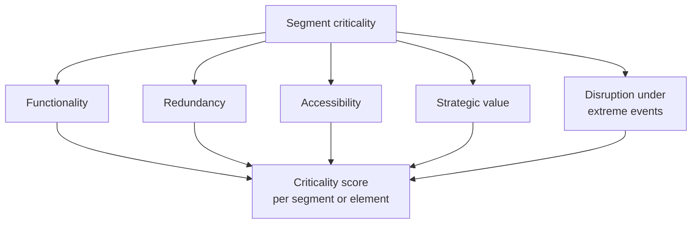

# Criticality Module

The criticality module evaluates the **relative importance** of road infrastructure elements — roads, bridges, intersections — within the transport network. Its objective is to identify those segments or structures whose interruption would generate the greatest functional or economic consequences, serving as a basis for informing the alternative routes traffic must take when a segment becomes disabled by a natural event.

## Definition of criticality in the road network

Criticality is a combined measure that integrates:

- The **structural importance** of the element within the network topology.
- The **functional impact** of its loss or interruption on regional mobility and the economy.

It is associated with both the function of the element and its position in the network, considering factors such as centrality, redundancy, and vehicle flow.

## Multi-criteria analysis methodology

BSA 2.0 proposes a multi-criteria approach that integrates five dimensions of criticality:

### 1. Functionality

Mobility indicators such as value added by traffic volume, service levels, or travel time. Quantified primarily from **Average Daily Traffic (ADT)** or monthly counts.

### 2. Redundancy

Measurement of available alternatives in case of segment failure, quantified through local redundancy metrics based on network topology (Morelli & Cunha, 2023). A segment without viable alternative routes has high criticality due to low redundancy.

### 3. Accessibility

Assessment of the ease with which key destinations can be reached from each network element: hospitals, schools, logistics centers, ports. Calculated using transport accessibility models that measure travel times and distances.

### 4. Strategic value

Qualitative or quantitative criteria that consider the segment's role in:

- Priority cargo or tourism corridors.
- Regional economic corridors.
- High socio-environmental risk zones.
- Official functional classification (highways, primary, secondary network, etc.).

### 5. Disruption under extreme events

Simulations of closure or capacity restrictions due to hazard events (floods, earthquakes, landslides), estimating the impact on the global network operation. This dimension is based on road network vulnerability analysis methodologies (Jenelius & Mattsson, 2014).

## Result: criticality score

The integration of these five factors generates a **criticality score** per segment or element, enabling a rating to be established and prioritizing the most sensitive components for intervention.

This score is used in **Route B** of the BSA 2.0 calculation flow (losses from traffic disruption): a transit vulnerability function (VF-traffic) is assigned to the EE according to its criticality level, and the expected functional loss (MDRt) multiplied by the economic transit value (VFt) is calculated:

$$
\text{Loss}_{\text{EE}} = \text{MDRt} \times \text{VFt}
$$

where MDRt is obtained from the transit vulnerability function, which models road operability behavior under event intensity given the segment's criticality level.

## Theoretical foundations

The hybrid approach of the criticality module is grounded in internationally recognized theoretical frameworks:

- **IIASA** (International Institute for Applied Systems Analysis): critical infrastructure network analysis.
- **Jenelius & Mattsson (2014)**: methodology for road network vulnerability analysis and segment importance metrics.
- **Jafino et al. (2019)**: comparison of multiple criticality metrics in road networks.

These methodologies combine topological analysis, vehicle flows, and territorial criteria, evaluating network resilience against possible failures and facilitating the planning of strategic interventions.

!!! tip "Relationship with traffic interruption cost"
    The criticality module is the basis for estimating the **economic cost of traffic interruption** (EAL). A segment with high criticality (high ADT, low redundancy, high accessibility to essential services) will generate greater functional losses for the same level of physical damage as a segment with low criticality.

---

*To see how the criticality score integrates into the risk calculation, see [Risk Calculation](calculo-riesgo.md).*
