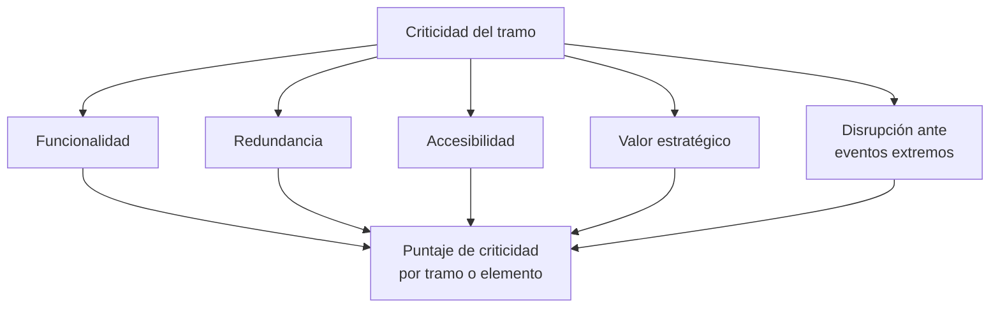

# Módulo de Criticidad

El módulo de criticidad evalúa la **importancia relativa** de los elementos de infraestructura vial —vías, puentes, intersecciones— dentro de la red de transporte. Su objetivo es identificar aquellos tramos o estructuras cuya interrupción generaría mayores consecuencias funcionales o económicas, sirviendo de base para informar las vías alternativas que debe tomar el tráfico cuando un segmento queda inhabilitado por un evento natural.

## Definición de criticidad en la red vial

La criticidad es una medida combinada que integra:

- La **importancia estructural** del elemento dentro de la topología de la red.
- El **impacto funcional** de su pérdida o interrupción sobre la movilidad y la economía regional.

Está asociada tanto a la función del elemento como a su posición en la red, considerando factores como centralidad, redundancia y flujo vehicular.

## Metodología de análisis multicriterio

El BSA 2.0 propone un enfoque multicriterio que integra cinco dimensiones de criticidad:

### 1. Funcionalidad

Indicadores de movilidad como valor añadido por volumen de tráfico, niveles de servicio o tiempo de viaje. Se cuantifica principalmente a partir del **Tránsito Promedio Diario (TPD)** o mensual.

### 2. Redundancia

Medición de las alternativas disponibles en caso de falla de un tramo, cuantificada a través de métricas de redundancia local basadas en la topología de la red (Morelli & Cunha, 2023). Un tramo sin rutas alternativas viables tiene alta criticidad por baja redundancia.

### 3. Accesibilidad

Evaluación de la facilidad con que se pueden alcanzar destinos clave desde cada elemento de la red: hospitales, escuelas, centros logísticos, puertos. Se calcula mediante modelos de accesibilidad del transporte que miden tiempos y distancias de viaje.

### 4. Valor estratégico

Criterios cualitativos o cuantitativos que consideran el papel del tramo en:

- Corredores prioritarios de carga o turismo.
- Corredores económicos regionales.
- Zonas de alto riesgo socioambiental.
- Clasificación funcional oficial (autopistas, red primaria, secundaria, etc.).

### 5. Disrupción ante eventos extremos

Simulaciones de cierre o restricción de capacidad debidas a eventos de amenaza (inundaciones, sismos, deslizamientos), estimando el impacto sobre el funcionamiento global de la red. Esta dimensión se basa en metodologías de análisis de vulnerabilidad de redes viales (Jenelius & Mattsson, 2014).

## Resultado: puntaje de criticidad

La integración de estos cinco factores genera un **puntaje de criticidad** por tramo o elemento, que permite establecer una calificación y priorizar los componentes más sensibles para la intervención.

Este puntaje se usa en la **Ruta B** del flujo de cálculo del BSA 2.0 (pérdidas por disrupción del tránsito): se asigna una función de vulnerabilidad para tránsito (FVU-tráfico) al EE según su nivel de criticidad, y se calcula la pérdida funcional esperada (PMVt) multiplicada por el valor económico del tránsito (VFt):

$$
\text{Pérdida}_{\text{EE}} = \text{PMVt} \times \text{VFt}
$$

donde PMVt se obtiene de la función de vulnerabilidad para tránsito, que modela el comportamiento de la operabilidad vial ante la intensidad del evento dado el nivel de criticidad del tramo.

## Fundamentos teóricos

El enfoque híbrido del módulo de criticidad se fundamenta en marcos teóricos reconocidos internacionalmente:

- **IIASA** (International Institute for Applied Systems Analysis): análisis de redes de infraestructura crítica.
- **Jenelius & Mattsson (2014)**: metodología de análisis de vulnerabilidad de redes viales y métricas de importancia de tramos.
- **Jafino et al. (2019)**: comparación de múltiples métricas de criticidad en redes viales.

Estas metodologías combinan análisis topológico, flujos vehiculares y criterios territoriales, evaluando la resiliencia de la red ante posibles fallas y facilitando la planificación de intervenciones estratégicas.

!!! tip "Relación con el costo de interrupción del tránsito"
    El módulo de criticidad es la base para estimar el **costo económico de la interrupción del tránsito** (PAE). Un tramo con alta criticidad (alta TPD, baja redundancia, alta accesibilidad a servicios esenciales) generará pérdidas funcionales mayores ante el mismo nivel de daño físico que un tramo con baja criticidad.

---

*Para ver cómo el puntaje de criticidad se integra en el cálculo del riesgo, véase [Cálculo de Riesgo](calculo-riesgo.md).*
