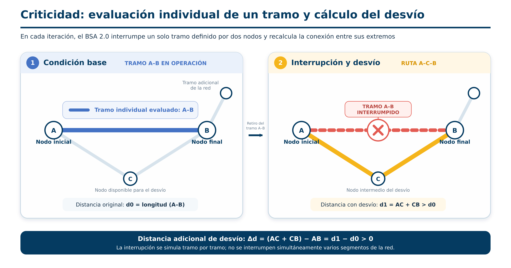
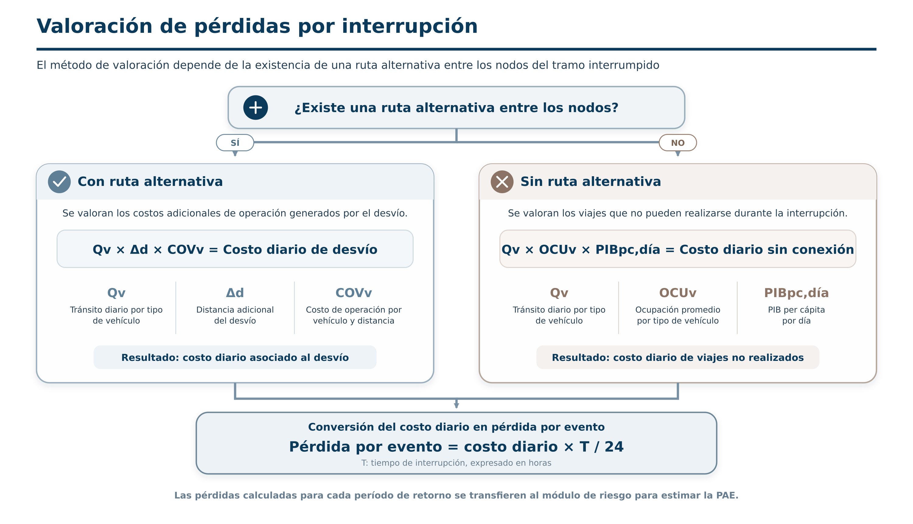

# Módulo de criticidad

## Función del módulo

La criticidad representa la consecuencia funcional y económica de interrumpir **un tramo individual entre dos nodos**. La versión actual no utiliza ponderaciones multicriterio: calcula el costo de desvío o, si no existe alternativa, el costo de los viajes no realizados.

## Red y ruta alternativa

El código construye un grafo no dirigido con los extremos geométricos de cada línea, redondeados a tres decimales. Para cada tramo (e=(a,b)):

1. toma su longitud (d_0);
2. retira únicamente ese tramo;
3. aplica Dijkstra entre (a) y (b);
4. obtiene la ruta alternativa más corta (d_1);
5. calcula (Delta d=\max(0,d_1-d_0)).

Si no existe conexión entre los nodos después de retirar el tramo —o uno de sus extremos es terminal— el elemento se trata como **sin ruta alternativa**.

!!! warning "Topología"
    El algoritmo no crea intersecciones ni corrige conectividad. Las líneas deben representar enlaces nodo–nodo y compartir coordenadas de extremo cuando estén conectadas.

## Tramos con ruta alternativa

Para cada categoría vehicular (v), el costo diario adicional es:

$$C_{desvío,e}=\sum_v Q_{e,v}\,\Delta d_e\,COV_v$$

donde (Q) es el tránsito diario, (Delta d) está en kilómetros y (COV) es el costo de operación por vehículo-km.

## Tramos sin ruta alternativa

Cuando no hay desvío, se aproxima el costo diario de viajes no realizados:

$$C_{sin\ alternativa,e}=\sum_v Q_{e,v}\,OCU_v\,PIB_{pc,día}$$

donde `OCU` es la ocupación media por vehículo y el PIB per cápita diario se ingresa directamente en la **moneda local** del país.

## Pérdida por evento

La función de vulnerabilidad entrega (T) horas de interrupción. La pérdida por escenario es:

$$L_e(TR)=C_{diario,e}\frac{T_e(TR)}{24}$$

## Datos requeridos

La base de operaciones es un CSV con una fila por `taxonomy` (`T9` a `T15`) y valores numéricos de `COV` y `OCU`. Los tramos requieren `Longitud`, los campos de tránsito `T9`–`T15` y topología coherente. La base de operaciones y el PIB per cápita diario deben suministrarse juntos; si ambos se omiten, la PAE se calcula con costo diario cero.

## Limitaciones

Se analiza una falla a la vez. No se modelan interrupciones simultáneas, congestión dinámica, cambios de demanda, capacidad vial, dirección efectiva del flujo ni tiempo de viaje. El resultado debe interpretarse como una aproximación comparativa.

