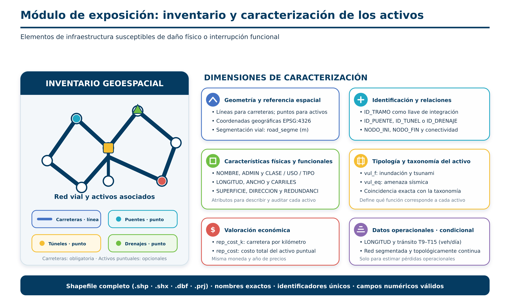

# Módulo de exposición

## Función del módulo

La exposición es el conjunto de sistemas y activos susceptibles de daño. El BSA 2.0 no crea ni completa el inventario: recibe capas preparadas por el usuario, las cruza con la amenaza y conserva los atributos necesarios para daño, interrupción y agregación.

## Capas admitidas

| Capa | Geometría | Función |
|---|---|---|
| Carreteras | Línea | Unidad de red y soporte de tránsito, daño, PAE y prioridad. |
| Puentes | Punto | Activo asociado a un tramo vial. |
| Túneles | Punto | Activo asociado a un tramo vial. |
| Drenajes | Punto | Activo asociado a un tramo vial. |

Todas las capas deben utilizar `EPSG:4326`, tener geometría válida, cobertura compatible y un identificador único sin nulos ni duplicados.

## Carreteras

| Campo | Tipo | Uso |
|---|---|---|
| `ID_TRAMO` | Entero | **Obligatorio.** Identificador único del tramo. |
| `NODO_INI`, `NODO_FIN` | Texto/entero | Recomendados para trazabilidad; la red de cálculo usa los extremos geométricos. |
| `NOMBRE`, `ADMIN`, `CLASE` | Texto | Descripción y clasificación. |
| `Longitud` | Numérico | Longitud del tramo en metros usada por el cálculo de desvío. |
| `ANCHO` | Numérico | Ancho en metros, cuando la función o el costo lo requiera. |
| `SUPERFICIE` | Texto | `S` o `N`, según la taxonomía adoptada. |
| `REDUNDANCI`, `DIRECCION`, `CARRILES` | Texto/entero | Atributos operacionales y de red. |
| `T9`–`T15` | Numérico | Tránsito diario por categoría vehicular. |
| `vul_f` | Texto | Taxonomía para inundación/tsunami. |
| `vul_eq` | Texto | Taxonomía para sismo. |
| `rep_cost_k` | Numérico | Costo de reposición en moneda local por kilómetro. |

El nombre `Longitud` refleja el campo que consulta la versión actual del código. Debe contener metros y ser coherente con la geometría.

## Puentes, túneles y drenajes

Cada activo puntual requiere:

| Campo | Tipo | Uso |
|---|---|---|
| `ID_PUENTE`, `ID_TUNEL` o `ID_DRENAJE` | Entero | Identificador único según la capa. |
| `ID_TRAMO` | Entero | Enlace con el tramo vial. |
| `NOMBRE`, `ADMIN`, `CLASE` | Texto | Caracterización. |
| `vul_f`, `vul_eq` | Texto | Taxonomías de vulnerabilidad. |
| `rep_cost` | Numérico | Costo total de reposición, en moneda local. |

Los campos adicionales de material, dimensiones o capacidad pueden conservarse, pero sus nombres y unidades deben documentarse.

## Segmentación y muestreo

`Road segment length (m)` determina la separación de los puntos con los que se muestrea la intensidad sobre las líneas. Debe elegirse en relación con el tamaño de celda del ráster de amenaza:

- un valor menor produce más puntos y mayor detalle espacial, pero aumenta el tiempo de cómputo;
- un valor mayor acelera la corrida, pero puede omitir variaciones locales.

Este parámetro no corrige la topología ni sustituye la preparación previa de los tramos nodo–nodo.

## Validación mínima

1. Confirmar `EPSG:4326`.
2. Reparar geometrías y eliminar identificadores nulos o duplicados.
3. Comprobar que cada activo puntual referencia un `ID_TRAMO` existente.
4. Revisar que taxonomías, costos y tránsito estén completos y en unidades homogéneas.
5. Verificar que cada línea represente un único enlace entre nodos de la red.

