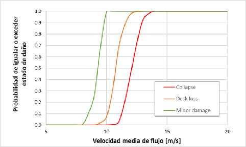
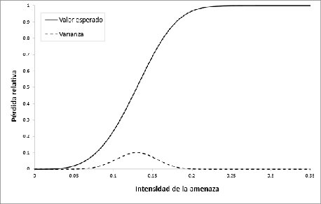

# Vulnerability Module

The vulnerability module estimates the **proportion of expected economic damage** on exposed elements based on their typology, physical characteristics, and the local conditions of the hazard. This estimation is based on **vulnerability functions** that relate event intensity to a damage metric.

## Core concept: the Mean Damage Ratio (MDR)

The Mean Damage Ratio (**MDR**, or *RMD* in Spanish) is the key metric of the vulnerability module. It represents the fraction of the asset's physical value expected to be lost at a given level of hazard intensity:

$$
\text{MDR} \in [0, 1]
$$

- **MDR = 0**: no damage.
- **MDR = 1**: total damage (complete destruction).

The MDR is technically a random variable, characterized by a probability density function (PDF). In the initial versions of BSA 2.0, however, the **expected value** of this distribution is used, without explicitly propagating uncertainty (see [Purpose and scope](proposito-alcances.md)).

## Vulnerability functions versus fragility functions

These two tools are conceptually distinct and often confused:

| Characteristic | Vulnerability function | Fragility function |
|---|---|---|
| **Response variable** | Expected economic damage (MDR) | Probability of reaching a damage state |
| **Format** | Continuous curve intensity → average MDR | Exceedance curve: $P(ED \geq ed \mid TH)$ |
| **Use in BSA 2.0** | ✅ Direct | Requires conversion |
| **Advantage** | Directly produces economic damage | More common in technical literature |

Technical literature typically reports fragility curves. BSA 2.0 includes procedures to **convert fragility curves into vulnerability functions**, using the relationship:

$$
P(ED = ed \mid TH) = P(ED \geq ed_{i+1} \mid TH) - P(ED \geq ed_i \mid TH)
$$

This probability mass function allows calculating the expected damage value for each intensity level, transforming the fragility curve into the required vulnerability function.

### Example: fragility curve for a bridge

The following figure shows an example of fragility curves for a reinforced concrete bridge with 50 years of deterioration (Kim et al., 2017), defining three damage states (minor damage, deck loss, collapse), as a function of mean flow velocity:

**Figure 1.** Fragility function for current bridge condition (adapted from Kim et al., 2017).  
*Source: BSA 2.0 Concept Report (IDB, 2025).*

## Road typologies and function assignment

The analysis starts from the **classification of infrastructure into homogeneous typologies**:

- Road segments (by pavement type and hierarchy)
- Bridges and viaducts (by material and structural system)
- Drainage systems (culverts, box culverts, gratings)
- Control structures (dikes, retaining walls)

Each typology is assigned a specific vulnerability function, calibrated for the combination of hazard intensity and asset type. For example, a reinforced concrete bridge with deep foundations may respond differently to flooding or an earthquake than a metal culvert or an embankment segment.

### Example of a vulnerability function

The following figure illustrates the concept of a vulnerability function:

**Figure 2.** Example of a vulnerability function (intensity vs. average MDR).  
*Source: BSA 2.0 Concept Report (IDB, 2025).*

## Levels of analysis: qualitative and quantitative

The tool operates at two levels depending on information availability:

=== "Quantitative analysis"
    When detailed typologies and hazard models with physical magnitudes are available, explicit vulnerability functions are applied and the MDR is modeled as a probabilistic variable. This is the preferred level of analysis for BSA 2.0.

=== "Qualitative analysis"
    When quantifiable data is not available, classification matrices and estimative ranges (low, medium, high vulnerability) based on technical criteria and local expertise are used.

This duality allows BSA 2.0 to adapt to contexts with different levels of information, while maintaining traceability and methodological consistency.

## Modular function library

BSA 2.0 includes a **modular library of vulnerability functions** by infrastructure type and hazard type, structured as an updatable repository by national technical teams.

The library integrates functions extracted from recognized international studies:

- **FEMA / HAZUS**: database of functions for infrastructure in the U.S.
- **CAPRA**: IDB platform for probabilistic risk assessment.
- **RiskScape**: New Zealand risk analysis platform.
- Specific academic studies by asset type and hazard.

The modularity of the library allows:

- Integrating new functions as better data becomes available.
- Applying country-specific, geographic zone, or territorial entity functions.
- Maintaining technical consistency when analyzing multiple regions or countries.

---

*To understand how the MDR is multiplied by economic values to obtain damage and loss, see [Risk Calculation](calculo-riesgo.md).*
