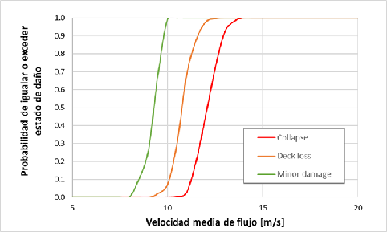
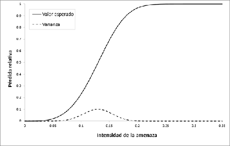

# Módulo de Vulnerabilidad

El módulo de vulnerabilidad estima la **proporción de daño económico esperado** sobre los elementos expuestos en función de su tipología, características físicas y las condiciones locales de la amenaza. Esta estimación se basa en **funciones de vulnerabilidad** que relacionan la intensidad del evento con una métrica de daño.

## Concepto central: la Relación Media de Daño (RMD)

La Relación Media de Daño (**RMD**) es la métrica clave del módulo de vulnerabilidad. Representa la fracción del valor físico del activo que se espera perder ante un determinado nivel de intensidad de amenaza:

$$
\text{RMD} \in [0, 1]
$$

- **RMD = 0**: sin daño.
- **RMD = 1**: daño total (destrucción completa).

La RMD es técnicamente una variable aleatoria, caracterizada por una función de densidad de probabilidad (FDP). En las versiones iniciales del BSA 2.0, sin embargo, se trabaja con el **valor esperado** de esta distribución, sin propagar explícitamente la incertidumbre (véase [Propósito y alcances](proposito-alcances.md)).

## Funciones de vulnerabilidad versus funciones de fragilidad

Estas dos herramientas son conceptualmente distintas y a menudo se confunden:

| Característica | Función de vulnerabilidad | Función de fragilidad |
|---|---|---|
| **Variable de respuesta** | Daño económico esperado (RMD) | Probabilidad de alcanzar un estado de daño |
| **Formato** | Curva continua intensidad → RMD promedio | Curva de excedencia: $P(ED \geq ed \mid TH)$ |
| **Uso en BSA 2.0** | ✅ Directo | Requiere conversión |
| **Ventaja** | Produce directamente el daño económico | Más frecuente en la literatura técnica |

La literatura técnica suele reportar curvas de fragilidad. El BSA 2.0 incluye procedimientos para **convertir curvas de fragilidad en funciones de vulnerabilidad**, utilizando la relación:

$$
P(ED = ed \mid TH) = P(ED \geq ed_{i+1} \mid TH) - P(ED \geq ed_i \mid TH)
$$

Esta función de masa de probabilidad permite calcular el valor esperado del daño para cada nivel de intensidad, transformando la curva de fragilidad en la función de vulnerabilidad necesaria.

### Ejemplo: curva de fragilidad para un puente

La figura siguiente muestra un ejemplo de curvas de fragilidad para un puente de concreto reforzado con 50 años de deterioro (Kim et al., 2017), definiendo tres estados de daño (daño menor, pérdida del tablero, colapso), en función de la velocidad media del flujo:

**Figura 1.** Función de fragilidad para condición actual de un puente (adaptado de Kim et al., 2017).  
*Fuente: Concept Report BSA 2.0 (BID, 2025).*

## Tipologías viales y asignación de funciones

El análisis parte de la **clasificación de la infraestructura en tipologías homogéneas**:

- Tramos viales (por tipo de pavimento y jerarquía)
- Puentes y viaductos (por material y sistema estructural)
- Sistemas de drenaje (alcantarillas, cajas, rejillas)
- Estructuras de control (diques, muros de contención)

A cada tipología se asigna una función de vulnerabilidad específica, calibrada para la combinación de intensidad de amenaza y tipo de activo. Por ejemplo, un puente de concreto armado con cimentación profunda puede responder de manera diferente ante una inundación o un sismo que una alcantarilla metálica o un tramo en terraplén.

### Ejemplo de función de vulnerabilidad

La figura siguiente ilustra el concepto de función de vulnerabilidad:

**Figura 2.** Ejemplo de función de vulnerabilidad (intensidad vs. RMD promedio).  
*Fuente: Concept Report BSA 2.0 (BID, 2025).*

## Niveles de análisis: cualitativo y cuantitativo

La herramienta opera en dos niveles según la disponibilidad de información:

=== "Análisis cuantitativo"
    Cuando se dispone de tipologías detalladas y modelos de amenaza con magnitudes físicas, se aplican funciones de vulnerabilidad explícitas y se modela la RMD como variable probabilista. Este es el nivel de análisis preferido del BSA 2.0.

=== "Análisis cualitativo"
    Cuando no se dispone de datos cuantificables, se utilizan matrices de clasificación y rangos estimativos (baja, media, alta vulnerabilidad) basados en criterios técnicos y experticia local.

Esta dualidad permite adaptar el BSA 2.0 a contextos con distintos niveles de información, manteniendo la trazabilidad y consistencia metodológica.

## Librería modular de funciones

El BSA 2.0 incluye una **librería modular de funciones de vulnerabilidad** por tipo de infraestructura y tipo de amenaza, estructurada como un repositorio actualizable por los equipos técnicos nacionales.

La librería integra funciones extraídas de estudios internacionales reconocidos:

- **FEMA / HAZUS**: base de datos de funciones para infraestructura en EE. UU.
- **CAPRA**: plataforma del BID para evaluación probabilista de riesgo.
- **RiskScape**: plataforma neozelandesa de análisis de riesgo.
- Estudios académicos específicos por tipo de activo y amenaza.

La modularidad de la librería permite:

- Integrar nuevas funciones a medida que se disponga de mejores datos.
- Aplicar funciones específicas por país, zona geográfica o entidad territorial.
- Mantener consistencia técnica al analizar múltiples regiones o países.

---

*Para entender cómo la RMD se multiplica por los valores económicos para obtener el daño y la pérdida, véase [Cálculo de Riesgo](calculo-riesgo.md).*
