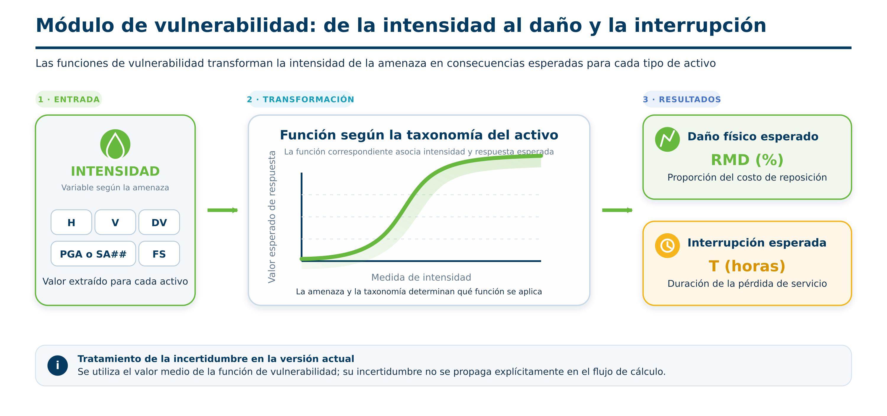

# Módulo de vulnerabilidad

## Función del módulo

El módulo transforma la intensidad de amenaza en dos consecuencias esperadas:

- **RMD (%):** porcentaje medio de daño físico.
- **T (horas):** tiempo esperado de interrupción.

El BSA 2.0 no genera ni calibra estas funciones. El usuario debe seleccionar funciones técnicamente justificadas y asegurar que sus taxonomías coincidan con la exposición.

## Archivo de entrada

La base se carga como CSV codificado preferiblemente en UTF-8. Cada registro identifica una función y contiene arreglos pareados de intensidad y respuesta.

| Campo | Contenido |
|---|---|
| `taxonomy` | Clave única de la función. |
| `intensity` | Lista ordenada de intensidades. |
| `value` | Lista de RMD (%) o tiempo (h), con igual longitud que `intensity`. |

La RMD se registra de **0 a 100**; el código la divide por 100 antes de multiplicarla por el costo de reposición. Los tiempos se registran en horas y se convierten internamente a fracción de día mediante (T/24).

## Taxonomías

La clave debe identificar como mínimo el activo, la amenaza, la medida de intensidad y el tipo de curva.

| Caso | Estructura | Ejemplo |
|---|---|---|
| Daño por inundación | `FL_RMD_<IM>_<COMP>` | `FL_RMD_H_TRNP` |
| Tiempo por inundación | `FL_T_<IM>_<COMP>` | `FL_T_H_TRNP` |
| Daño sísmico | `EQ_RMD_<IM>_<COMP>` | `EQ_RMD_PGA_TUNNA` |
| Daño sísmico con LQ | `EQ_RMD_<LQ>_<IM>_<COMP>` | `EQ_RMD_LQ1_PGA_TUNNA` |
| Tiempo sísmico | `EQ_T_<IM>_<COMP>` | `EQ_T_PGA_TUNNA` |

Medidas: `H` (m), `V` (m/s), `DV` (m²/s), `PGA` (g), `SA##` (g) y `FS` (adimensional). Componentes: `TRN`, `REG`, `LOC`, `CAM`, `TUN`, `DRN`, `BRG` y `CCM`; superficies: `P`, `U` o `NA`. En sismo, el enlace de medida reconocido es **`SA`**; no utilice `SAT`.

Las taxonomías usadas en `vul_f` y `vul_eq` deben coincidir exactamente con las claves disponibles en el CSV. Para sismo puede añadirse la clase de licuefacción cuando corresponda.

`vul_f` y `vul_eq` almacenan el sufijo, no la clave completa. Por ejemplo, `vul_f = H_TRNP` permite construir `FL_RMD_H_TRNP` y `FL_T_H_TRNP`.

!!! warning "Correspondencia de licuefacción por verificar en el código incluido"
    El contrato de datos define 1→`LQ1`, 2→`LQ2`, 3→`LQ3` y 4→`LQ4`. Sin embargo, la versión de `BSA2.py` incluida en este repositorio agrupa las clases 1 y 2 como `LQ1` y desplaza las siguientes. Esta discrepancia debe resolverse antes de utilizar licuefacción en producción.

## Interpolación

Para una intensidad (I), el toolbox interpola linealmente entre los puntos de la función. Si (I) queda fuera de su dominio, se limita al valor del extremo más cercano. La versión actual usa el valor medio de la función y no propaga explícitamente su incertidumbre.

El daño monetario de un escenario es:

$$D(I)=\frac{RMD(I)}{100}\,C_{rep}$$

La fracción de interrupción usada en la pérdida del evento es:

$$f_T(I)=\frac{T(I)}{24}$$

## Comprobaciones

- igual número de valores en ambos arreglos;
- intensidades numéricas y crecientes;
- RMD entre 0 y 100;
- tiempos no negativos;
- sin taxonomías duplicadas;
- unidades compatibles con las mallas;
- todas las taxonomías de exposición resueltas.

Una función ausente o mal codificada puede convertirse en daño o tiempo cero sin representar la realidad. Revise los mensajes de ejecución y haga controles puntuales antes de interpretar agregados.
