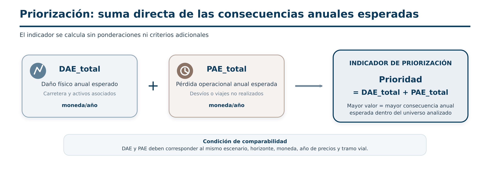

# Priorización

## Regla de cálculo

La priorización del BSA 2.0 es deliberadamente simple. No utiliza análisis multicriterio, ponderaciones, normalización ni clasificación automática:

$$Priority = DAE_{total} + PAE_{total}$$

Ambos términos deben estar expresados en la misma moneda y año base. En carreteras, `DAE_total` incluye el daño anual de la línea y el de los activos puntuales asociados. En cada capa puntual, el código suma su `DAE` y su `PAE_total`.

## Interpretación

Un valor mayor indica una mayor concentración de consecuencias económicas anuales esperadas dentro del universo analizado. El campo puede ordenarse o simbolizarse para construir el mapa de priorización, pero no define por sí solo qué proyecto debe financiarse.

## Condiciones de comparabilidad

Antes de ordenar activos, compruebe:

- misma moneda, año base y tratamiento de precios;
- mismas amenazas y períodos de retorno;
- cobertura homogénea de tránsito y costos;
- taxonomías y funciones de vulnerabilidad comparables;
- ausencia de nulos convertidos inadvertidamente en cero;
- correcta asociación de activos puntuales con tramos.

La priorización es una señal de cribado. La selección de medidas requiere análisis complementarios de costo-beneficio, factibilidad, equidad, ambiente y política pública.

